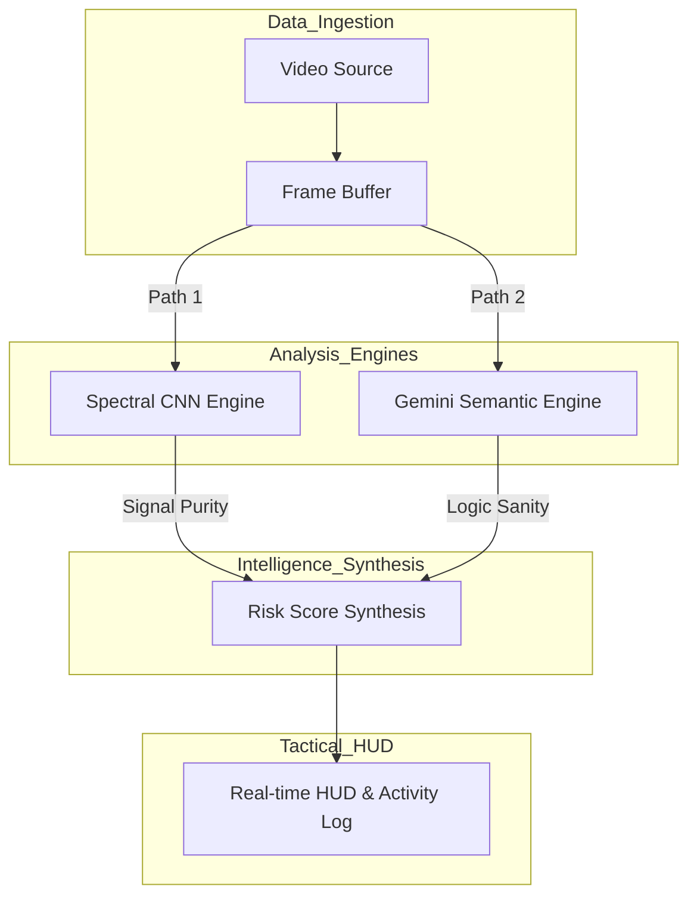

# AXON.SEC // FSD Vision Stack Integrity & Security

## Overview
AXON.SEC is a professional-grade cybersecurity platform engineered to protect the vision-processing pipelines of autonomous vehicles and high-integrity robotics. In Full Self-Driving (FSD) environments, camera-based perception is the critical decision-making organ. This reliance creates a vulnerability to "optical malware"—adversarial visual inputs or digital signal injections designed to trick AI models into misidentifying road signs or ignoring safety-critical obstacles.

The platform provides a real-time defense layer that monitors video streams through a dual-lock system: verifying the mathematical integrity of the pixel signal and auditing the semantic logic of the environment.

## System Architecture
AXON.SEC utilizes a parallel-processing pipeline to ensure zero-latency bottlenecks during high-speed FSD analysis.

**Figure 1: AXON.SEC Parallel Defense Workflow.** The architecture bifurcates raw vision data into two specialized agents. Path 1 analyzes the pixel-level spectral frequencies for tampering, while Path 2 uses deep semantic reasoning to ensure the scene's logic remains consistent with road physics.

## Technical Tech Stack
*   **Semantic Intelligence**: Google Gemini 2.5 Flash
*   **Neural Processing**: TensorFlow.js (Custom Spectral CNN)
*   **Application Framework**: React 19 (ES6+)
*   **Interface Layer**: Tailwind CSS
*   **Data Visualization**: Recharts
*   **Vision Streaming**: HTML5 MediaStream API

## Documentation
For a comprehensive breakdown of feature mechanics, neural processing logic, and security configurations, please refer to the technical specification:

[Technical Specification](./documentation.md)

---
**Date:** 12/25/2025  
**Developer:** Ritvik Indupuri