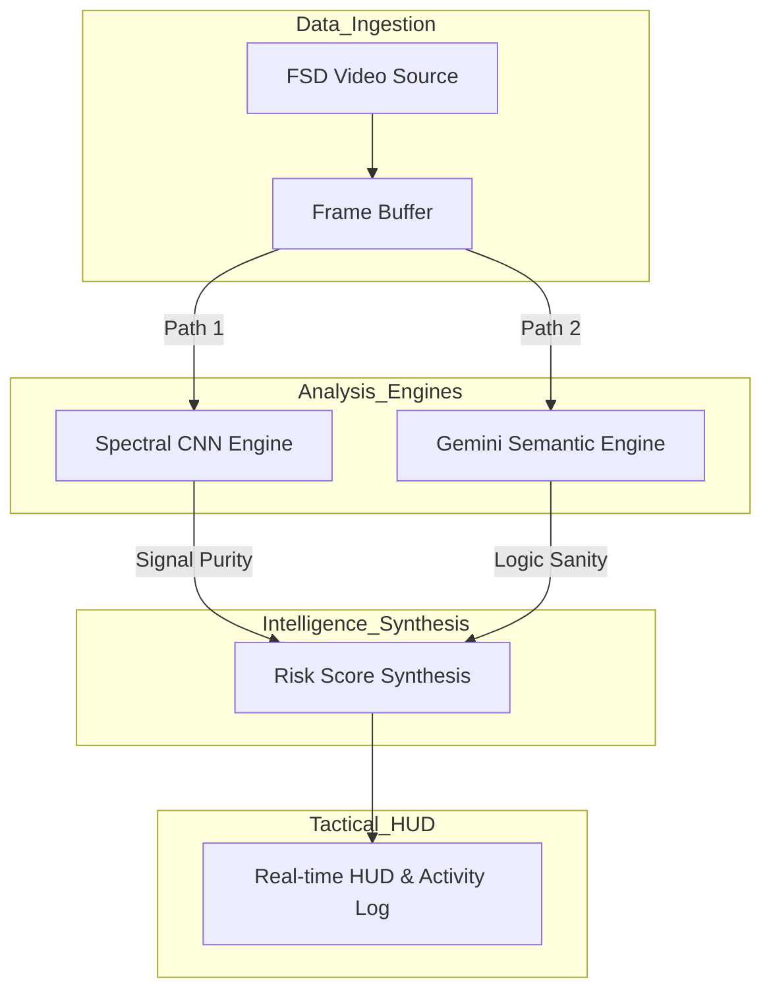

# AXON.SEC - Autonomous Vision Defense

## Overview
AXON.SEC is a high-integrity cybersecurity framework engineered to protect the vision-processing pipelines of Full Self-Driving (FSD) vehicles and advanced robotics. In autonomous systems, the perception layer is the primary decision-making organ. This reliance creates a vulnerability to **Adversarial Optical Malware**—visual inputs designed to deceive AI models while appearing benign to human observers.

The platform provides a real-time defense layer that monitors vision streams through a dual-lock system: verifying the mathematical integrity of the pixel signal and auditing the semantic logic of the environment.

## System Architecture
The platform utilizes a parallel-processing pipeline to ensure zero-latency bottlenecks during high-speed FSD analysis.

**Figure 1: AXON.SEC Parallel Defense Workflow.** The architecture bifurcates raw vision data into two specialized processing agents. Path 1 (CNN) analyzes pixel-level spectral frequencies for structural tampering, while Path 2 (Gemini) uses deep semantic reasoning to ensure the scene's logic remains consistent with road physics.

## Core Technologies
*   **Semantic Intelligence**: Google Gemini 2.5 Flash
*   **Neural Processing**: TensorFlow.js (Custom Spectral CNN)
*   **Application Framework**: React 19 (ES6+)
*   **Tactical Interface Layer**: Tailwind CSS
*   **High-Frequency Telemetry**: Recharts
*   **Vision Data Streaming**: HTML5 MediaStream API

## Documentation
For a comprehensive technical breakdown of feature mechanics, neural processing algorithms, and security governance, please refer to the detailed specification:

[Technical Specification](./documentation.md)

---
**Date:** 12/25/2025  
**Lead Developer:** Ritvik Indupuri