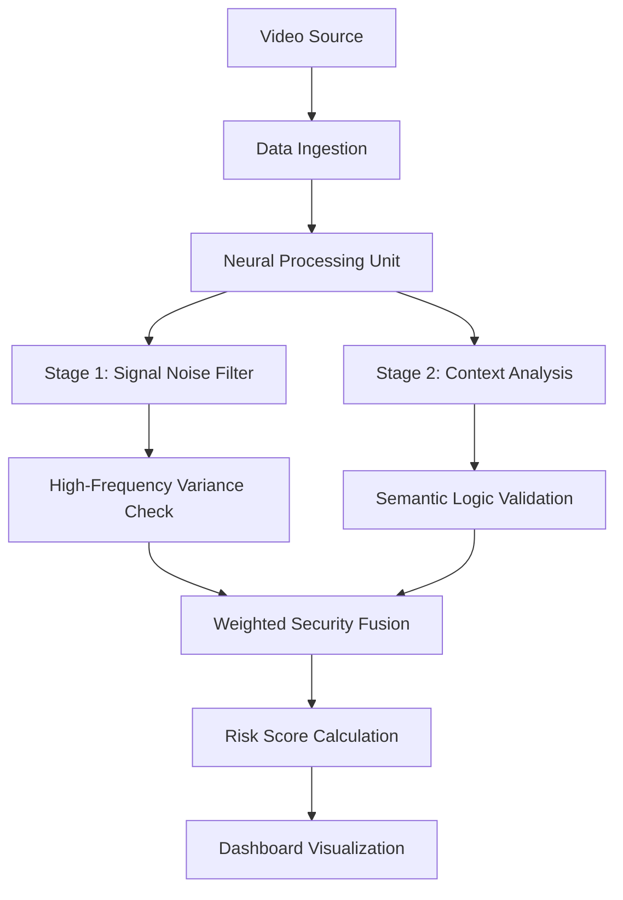

# AXON.SEC Neural Vision Defense

## Overview
AXON.SEC is a high-performance security platform designed to analyze autonomous vehicle vision streams. It identifies adversarial threats—often referred to as optical malware—that attempt to deceive self-driving algorithms through visual manipulation or digital injection.

## System Architecture



### Functional Explanation
The architecture operates on a dual-path verification model:
1. Signal Noise Filter: A mathematical analysis layer that scans for non-natural patterns in the video data. This layer is responsible for detecting digital injections or physical adversarial stickers.
2. Context Analysis: A semantic layer that evaluates the environmental logic of the scene. It ensures that the perceived objects and their behaviors align with real-world physics and situational expectations.

## Key Features
- Real-time CNN Spectral Analysis: High-frequency noise detection with an adjustable activation heatmap overlay.
- Semantic Threat Detection: Contextual logic verification powered by the Gemini 2.5 Flash model.
- Configurable Security Thresholds: User-defined sensitivity for Threat and Noise scores to trigger critical alerts.
- Multi-category Log Filtering: Ability to isolate 'Manipulated Sign', 'Image Noise', or 'Logic Error' events in the activity feed.
- Tactical Video Interface: Professional media player with play/pause, seeking, and volume controls for frame-by-frame analysis.

## Setup Instructions

### Prerequisites
- Node.js version 18 or higher
- NPM version 9 or higher
- Access to a Google Gemini API Key

### Installation
1. Clone the project repository to your local environment.
2. Open a terminal in the project root directory.
3. Execute the following command to install required dependencies:
   ```bash
   npm install
   ```

### Configuration
The system requires an API key for the analysis engines.
1. Create a .env file in the root directory of the project.
2. Define the following variable in the file:
   ```text
   API_KEY=your_api_key_value
   ```

### Execution
To launch the application in a development environment:
1. Run the development script:
   ```bash
   npm run dev
   ```
2. Open your browser and navigate to the local server address provided in the terminal output.

## Operational Guide
1. Select the "Upload Video" option to ingest a vision recording.
2. Adjust the "System Config" sliders in the right panel to set your preferred detection sensitivity.
3. Use the "Heatmap Opacity" slider to balance visual confirmation with raw footage clarity.
4. Apply category filters in the "Activity Feed" to focus on specific threat types during playback.
5. Review the "Stability Tracker" to identify intermittent signal integrity issues.