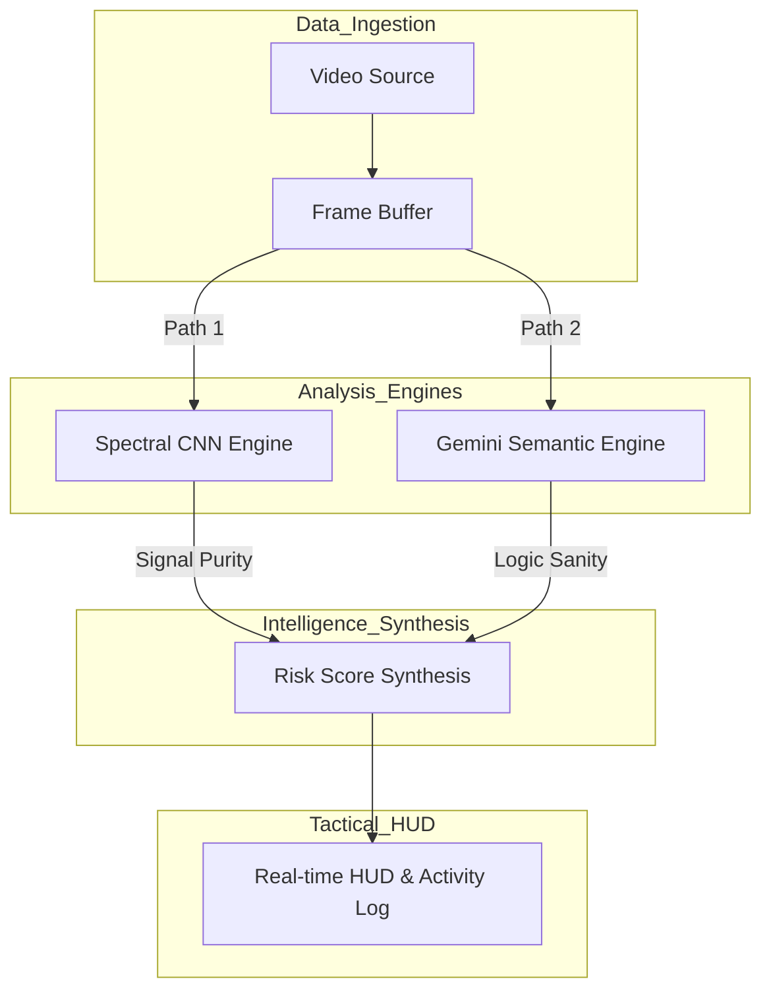

# AXON.SEC // Neural Defense Platform

## Overview
AXON.SEC is a professional-grade cybersecurity framework engineered to safeguard the vision-processing pipelines of Full Self-Driving (FSD) vehicles and high-integrity robotics. As autonomous systems transition to high-stakes environments, their reliance on neural perception introduces a critical vulnerability: **Adversarial Optical Malware**. 

This platform provides a real-time defense layer that monitors vision streams through a dual-lock verification system. By mathematically auditing pixel signal integrity and semantically verifying situational logic, AXON.SEC ensures that autonomous decision-making engines operate only on authenticated, non-tampered data.

## System Architecture
The platform utilizes a high-concurrency, parallel-processing pipeline to maintain zero-latency bottlenecks during high-speed FSD analysis.

**Figure 1: AXON.SEC Parallel Defense Workflow.** The architecture bifurcates raw vision data into two specialized processing agents. The first agent (Path 1) analyzes pixel-level spectral frequencies for structural tampering, while the second agent (Path 2) uses deep semantic reasoning via Gemini 2.5 to ensure the scene's logic remains consistent with known road physics and safety regulations.

## Technical Tech Stack
*   **Semantic Intelligence Engine**: Google Gemini 2.5 Flash
*   **Neural Spectral Processor**: TensorFlow.js (Custom Spectral CNN)
*   **Application Framework**: React 19 (ES6+)
*   **Tactical Interface Layer**: Tailwind CSS
*   **High-Frequency Telemetry**: Recharts
*   **Vision Data Streaming**: HTML5 MediaStream API

## Documentation
For a comprehensive technical breakdown of feature mechanics, neural processing algorithms, and security governance, please refer to the detailed specification:

[Technical Specification](./documentation.md)

---
**Date:** 12/25/2025  
**Lead Developer:** Ritvik Indupuri