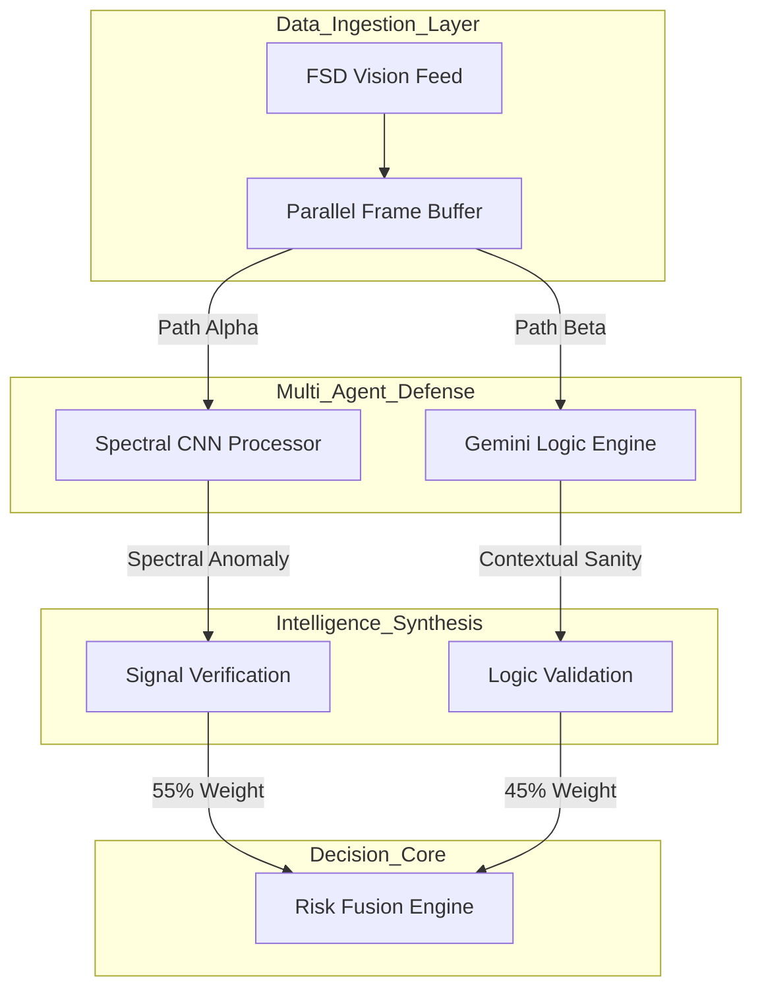
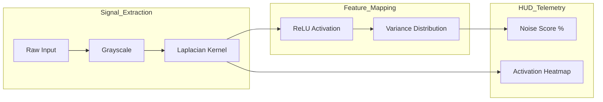
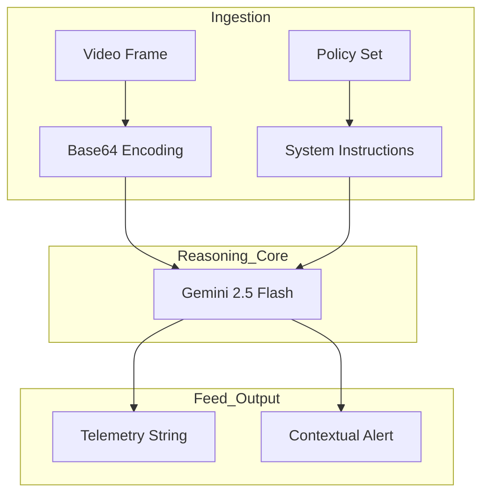

# AXON.SEC Technical Documentation - FSD Security System
**Date:** 12/25/2025  
**Author:** Ritvik Indupuri

---

 
 

## 1.0 Executive Summary

AXON.SEC is a specialized, industrial-grade cybersecurity framework engineered for the high-integrity verification of autonomous vehicle vision systems. In modern Full Self-Driving (FSD) stacks, the perception layer is the primary decision-making organ, responsible for identifying hazards, interpreting signage, and maintaining lane discipline. 

The platform provides a "Double-Lock" defense mechanism that neutralizes adversarial optical malware. This is achieved by fusing mathematical spectral analysis (checking the signal's physical health) with high-level semantic reasoning (checking the scene's logical sanity). By operating as a real-time auditor, AXON.SEC ensures that autonomous systems do not fall victim to "Perception Deception," where manipulated visual data leads to catastrophic navigation failures.

 
 

## 2.0 System Objectives & Threat Modeling

### 2.1 The FSD Perception Lifecycle
In a standard autonomous vehicle stack, vision data is ingested from high-resolution CMOS sensors, pre-processed for noise, and fed into deep neural networks for object detection and path planning. AXON.SEC sits as a high-performance proxy in this lifecycle, auditing the data *before* it reaches the primary decision-making layers. This allows the vehicle to discard compromised frames or transition into a safe "limp-home" mode before a security breach can impact the steering or braking logic.

### 2.2 Taxonomy of Visual Attacks
The platform is specifically tuned to detect three primary categories of adversarial interference that threaten the integrity of autonomous mobility:

*   **Adversarial Patches**: These are physical objects or stickers placed on road infrastructure. They contain high-frequency patterns mathematically optimized to exploit the "blind spots" in neural networks, causing a stop sign to be read as a speed limit sign, for example.
*   **Signal Injection**: This involves hacking the camera sensor hardware or the communication bus to inject digital noise. This noise can create "ghost" obstacles to force emergency braking or hide actual hazards to cause collisions.
*   **Logic Exploits**: These are complex visual manipulations that appear perfect at a pixel level but violate the laws of physics—such as inconsistent lighting, floating objects, or signage that contradicts the geographical context.

 
 

## 3.0 Technical Infrastructure

### 3.1 Application Core & State Management
The platform is orchestrated using **React 19**, leveraging its optimized concurrent rendering engine to manage a high-bandwidth telemetry stream. To maintain zero-latency in the user interface, state management is decentralized into modular React Hooks. This ensures that the heavy computational load of the **Spectral CNN Engine** and the asynchronous calls to the **Gemini 2.5 Logic Engine** do not cause frame drops in the tactical HUD.

### 3.2 WebGL-Accelerated Inference
The **Spectral CNN Engine** is built on **TensorFlow.js**, utilizing the browser's WebGL backend for hardware acceleration. By performing complex 2D convolutions directly on the GPU, AXON.SEC achieves sub-millisecond analysis times. This edge-based processing is critical for vehicle security, as it removes the dependency on cloud latency, which could be exploited in a high-speed driving scenario.

 
 

## 4.0 Global Neural Architecture

### 4.1 Parallel Multi-Agent Verification
To maintain the strict timing requirements of autonomous systems, AXON.SEC utilizes a parallel-processing pipeline. Every frame ingested from the vision feed is cloned and sent to two separate verification agents simultaneously.

<b>Figure 1: Global Parallel Processing Pipeline</b>

The system bifurcates raw data to allow for simultaneous mathematical and semantic auditing, ensuring that no single point of failure exists in the defense stack.

 
 

### 4.2 The Weighted Risk Fusion Engine
The **Risk Fusion Engine** is the central arbitrator of the platform. It takes the output from the CNN (which identifies mathematical tampering) and the Gemini engine (which identifies logical tampering) and synthesizes them into a single Risk Level. 

The current weighting—**55% Signal Integrity** and **45% Contextual Logic**—is optimized for detecting modern digital injection attacks, which are often the first stage of a more complex adversarial takeover.

 
 

## 5.0 Spectral CNN Processor: The Signal Layer

### 5.1 Mathematical Basis of Laplacian Convolution
The Spectral Processor identifies structural anomalies by analyzing the high-frequency components of the image. This is achieved via a **Laplacian Kernel**, a specialized 3x3 matrix that calculates the second-order spatial derivative of the image intensity. 

Essentially, this operation ignores the "colors" and "objects" and focuses purely on how quickly the brightness changes from pixel to pixel. In a tampered image, the transition between "real" pixels and "injected" noise creates a mathematical edge that the Laplacian kernel highlights with high intensity.

<b>Figure 2: Spectral Feature Extraction Flow</b>

This pipeline isolates the mathematical "texture" of the video signal. High-frequency adversarial noise appears as unnatural variance spikes in the resulting activation map.

 
 

### 5.2 Frequency Anomaly Extraction
Once the high-frequency components are isolated, the system computes the statistical variance of the activation map. In a natural, non-tampered frame, the variance is distributed predictably. In an adversarial frame, the noise creates "mathematical clusters" that significantly deviate from the baseline. This deviation is quantized into the **Noise Score**, which represents the mathematical purity of the visual signal.

 
 

## 6.0 Semantic Reasoning: The Logic Layer

### 6.1 Multi-Modal Situational Auditing
While the CNN looks at the *structure* of pixels, the Logic Layer uses **Gemini 2.5 Flash** to look at the *meaning* of the scene. It acts as an expert security auditor with human-level road-rule knowledge. Gemini analyzes frame segments for contradictions that a mathematical filter might miss, such as a stop sign that is physically perfect but logically impossible (e.g., located in the middle of a freeway).

<b>Figure 3: Semantic Logic Framework</b>

The Gemini engine processes multi-modal inputs to detect situational contradictions that indicate a logical visual manipulation or "deepfake" road environment.

 
 

### 6.2 Physics-Based Logic Verification
The Gemini engine communicates via structured telemetry strings, such as `[AXON_UPDATE]`. This allows AXON.SEC to quantify high-level AI reasoning into a numerical **Context Logic Score**. This score accounts for spatial inconsistencies, impossible lighting patterns, and object behaviors that defy the laws of road physics—all classic indicators of a sophisticated visual injection attack.

 
 

## 7.0 Functional Module Mechanics & Features

### 7.1 Video Ingestion & Forensic Frame Extraction
The **Video Upload** module handles the ingestion of high-bandwidth FSD vision files. To maintain forensic integrity, the platform creates an in-memory blob and never writes temporary data to the disk. Frames are extracted at **2.0 FPS**, a rate specifically selected to balance dense security coverage with the compute requirements of the Gemini reasoning engine.

 

### 7.2 Tactical Computer Vision & Heatmapping HUD
The **Computer Vision HUD** provides analysts with a live visual diagnostic. The output of the Laplacian filter is normalized and projected as a semi-transparent green overlay. Analysts can adjust the **Heatmap Opacity** to correlate detected spectral noise with physical objects in the video, seeing exactly which road sign or lane marking is triggering the alert.

 

### 7.3 Risk Level Quantization & Metrics
The **Risk Level** is the system's primary KPI. It is a synthesized percentage derived from:
*   **Signal Health (55%)**: The mathematical purity of the pixel data.
*   **Context Logic (45%)**: The situational "sanity" of the scene.
If the combined risk exceeds the operator's thresholds, the HUD shifts into a high-alert state, triggering red visual signals and logging a **CRITICAL** threat event.

 

### 7.4 Stability Tracker & Temporal Analysis
Because many adversarial attacks are designed to "flicker" and evade static detection, AXON.SEC includes a **Stability Tracker**. This Recharts-powered area chart monitors the Risk Level over a 30-second sliding window. This temporal visualization allows analysts to identify patterns of intermittent digital injection that a single-frame auditor would classify as random sensor noise.

 

### 7.5 Threat Summary & NLP Triage
The **Threat Summary** provides a natural language security brief of the current scene, powered by Gemini. It translates raw telemetry into actionable insights, such as: *"High probability of sign tampering detected; spectral noise exceeds safety thresholds."* Every detection is automatically categorized in the **Activity Feed** for rapid forensic triage and automated reporting.

 

### 7.6 System Configuration & Governance
The **System Config** panel gives operators granular control over the defense stack's tripwires. Through the **Threat Alert** and **Noise Alert** sliders, the system can be calibrated for different environmental variables. In rainy conditions where natural signal noise is higher, an operator might increase the noise threshold while maintaining maximum logic sensitivity.

 
 

## 8.0 Conclusion

AXON.SEC represents a paradigm shift in autonomous vehicle security. By merging the raw mathematical precision of spectral signal analysis with the high-level reasoning capabilities of Gemini 2.5 Flash, the framework provides a robust, verifiable, and transparent defense layer. This ensures that autonomous systems do not just "see" the world, but actively verify its integrity at every frame, paving the way for a more secure and reliable era of autonomous mobility.
