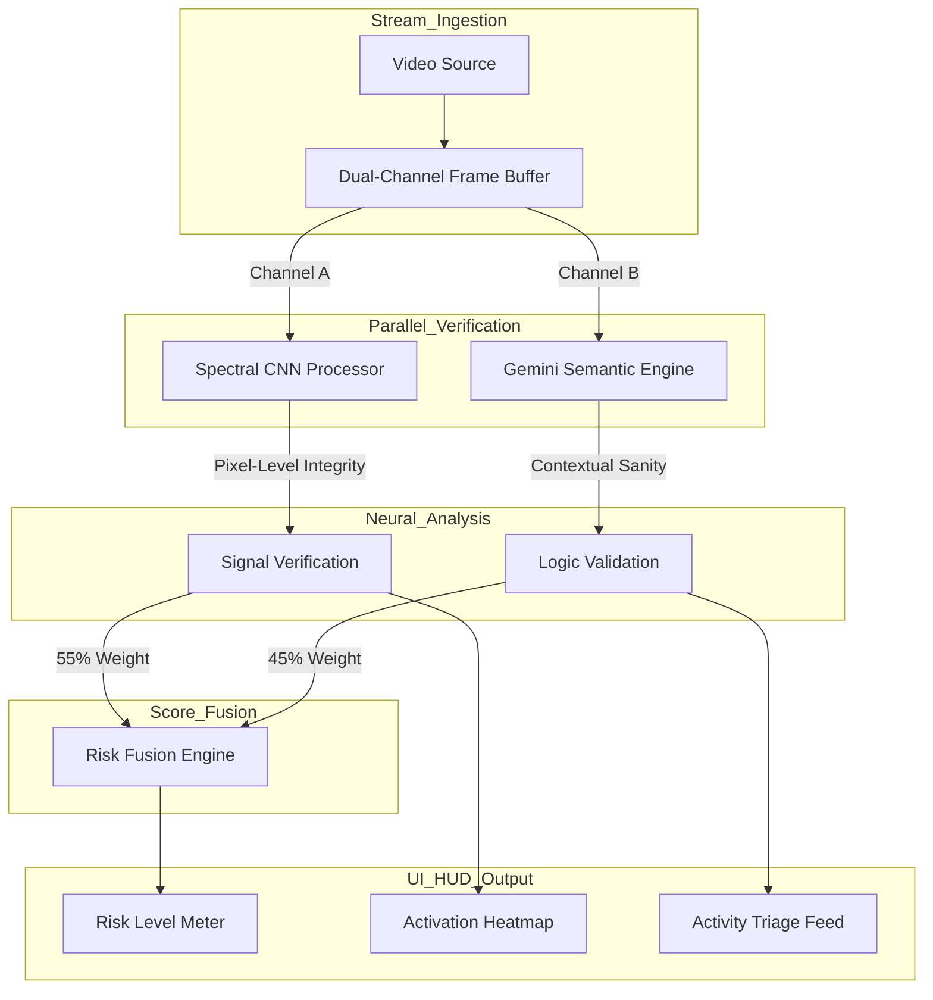
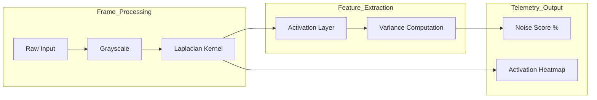
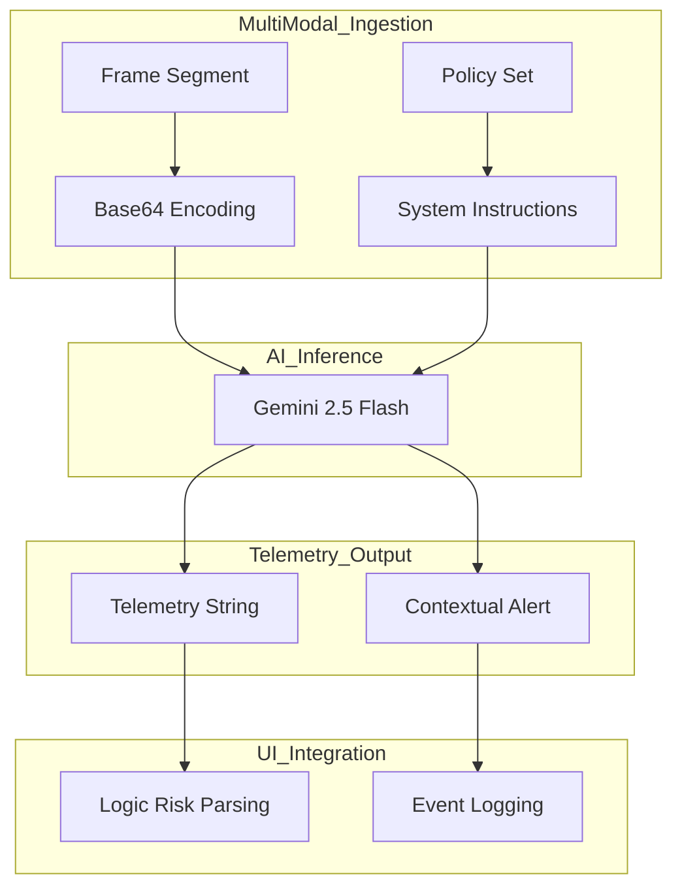

# AXON.SEC Technical Specification
**Date:** 12/25/2025  
**Author:** Ritvik Indupuri

---

## Table of Contents
1. [Executive Summary](#executive-summary)
2. [Technical Infrastructure](#technical-infrastructure)
3. [Global System Architecture](#global-system-architecture)
4. [Spectral CNN Engine: Signal Verification](#spectral-cnn-engine-signal-verification)
5. [Semantic Reasoning Engine: Gemini Logic](#semantic-reasoning-engine-gemini-logic)
6. [Detailed Feature Breakdown](#detailed-feature-breakdown)
    * [Video Upload & In-Memory Analysis](#video-upload--in-memory-analysis)
    * [Computer Vision & Tactical Heatmapping](#computer-vision--tactical-heatmapping)
    * [Risk Level Metrics & Scoring Logic](#risk-level-metrics--scoring-logic)
    * [Stability Tracker & Temporal Analysis](#stability-tracker--temporal-analysis)
    * [System Configuration & Alert Thresholds](#system-configuration--alert-thresholds)
    * [Threat Summary & Activity Feed](#threat-summary--activity-feed)
7. [Conclusion](#conclusion)

---

## Executive Summary
AXON.SEC is a specialized security framework engineered to defend autonomous mobility platforms against visual adversarial attacks. By deploying a hybrid verification layer, the system ensures that the vision data used for navigation is both mathematically authentic and logically sound. This multi-layered defense neutralizes "optical malware"—manipulated images or physical patches intended to deceive autonomous sensors.

## Technical Infrastructure
The platform is built on a modern, low-latency stack designed for real-time telemetry and heavy neural inference:

*   **Primary Logic**: Google Gemini 2.5 Flash for high-level semantic auditing.
*   **Neural Signal Processing**: TensorFlow.js for local, browser-based spectral analysis.
*   **Framework**: React 19 for modular component orchestration.
*   **HUD Design**: Tailwind CSS for a high-fidelity, tactical user interface.
*   **Telemetry**: Recharts for visualizing high-frequency risk data.

## Global System Architecture
The system operates on a parallel-processing paradigm where ingested video data is split into two distinct verification channels to ensure comprehensive security without introducing latency bottlenecks.

The system ingests raw video data and performs a dual-lock check. Channel A (CNN) looks at the "Math" of the image—searching for unnatural noise. Channel B (Gemini) looks at the "Meaning"—ensuring the scene follows road rules and physical reality. These results fuse into a single Risk Level displayed on the dashboard.

## Spectral CNN Engine: Signal Verification
The Spectral Engine is a custom convolutional neural network designed specifically for anomaly detection within high-frequency image components.

The engine applies a mathematical operation called a Laplacian derivative to every frame. This process isolates the highest frequencies in the image, effectively removing the "visual" layer and leaving only the underlying signal structure. Adversarial patches usually contain high-frequency "noise" that appears as unnatural spikes in this map. The system calculates the variance of these spikes to produce a Signal Health percentage and generates a green activation heatmap to highlight suspicious areas.

## Semantic Reasoning Engine: Gemini Logic
The Semantic Logic engine utilizes the Gemini 2.5 Flash model to provide a situational "sanity check" that mathematical filters might miss.

Using the `gemini-2.5-flash-native-audio-preview-09-2025` model, AXON.SEC performs a logical audit of the environment. It checks for impossible object behaviors or signage contradictions—such as a stop sign in a location that violates road physics. The model communicates via structured telemetry, allowing the interface to categorize specific "Logic Errors" and adjust the overall risk score.

## Detailed Feature Breakdown

### Video Upload & In-Memory Analysis
The platform supports direct video file ingestion via the **Upload Video** function. Once a file is provided, the system creates an in-memory blob to stream the footage without modifying the source file. Frames are extracted at a frequency of 2 FPS, which provides a high level of security coverage while maintaining browser performance. This allows for detailed forensic analysis of pre-recorded autonomous driving footage.

### Computer Vision & Tactical Heatmapping
The **Computer Vision** layer is the primary visual tool for security analysts. It features an **Activation Heatmap** overlay that can be adjusted via a slider. This heatmap visually isolates areas where the Spectral CNN identifies signal tampering. By increasing the **Heatmap Opacity**, analysts can pinpoint exactly which part of a road sign or obstacle has been mathematically compromised by an adversarial attack.

### Risk Level Metrics & Scoring Logic
The **Risk Level** is a synthesized percentage that provides a high-level summary of the system's security status. It is calculated using a weighted algorithm:
*   **Signal Integrity (55%)**: Based on the mathematical purity of the pixel data.
*   **Contextual Logic (45%)**: Based on the situational "sanity" of the scene.
The HUD turns red and displays a **THREAT_ALERT** whenever this combined score exceeds the user-defined thresholds.

### Stability Tracker & Temporal Analysis
Security threats are often intermittent. To combat this, the **Stability Tracker** provides a real-time area chart monitoring risk trends over a 30-second window. This allows analysts to identify "flickering" attacks—where a hacker injects noise for only a fraction of a second to avoid detection by standard filters.

### System Configuration & Alert Thresholds
The **System Config** panel gives operators granular control over the defense stack. Through intuitive sliders, users can set the **Threat Alert** and **Noise Alert** tripwires. For example, in poor weather conditions where natural image noise is higher, an operator might increase the noise threshold to reduce false positives while maintaining high semantic (logic) sensitivity.

### Threat Summary & Activity Feed
The **Threat Summary** provides a natural language explanation of the current security landscape, generated dynamically by the Gemini engine. This is complemented by the **Activity Feed**, which triages events into specific categories like 'Manipulated Sign', 'Image Noise', or 'Logic Error'. This categorization allows for rapid response and efficient post-event analysis.

## Conclusion
AXON.SEC is a robust, dual-layered security solution for autonomous systems. By integrating the pixel-perfect precision of spectral analysis with the deep reasoning capabilities of Gemini 2.5 Flash, the platform ensures that autonomous vehicles can trust what they see. The result is a verifiable, highly configurable, and transparent security layer that safeguards the future of autonomous mobility.
