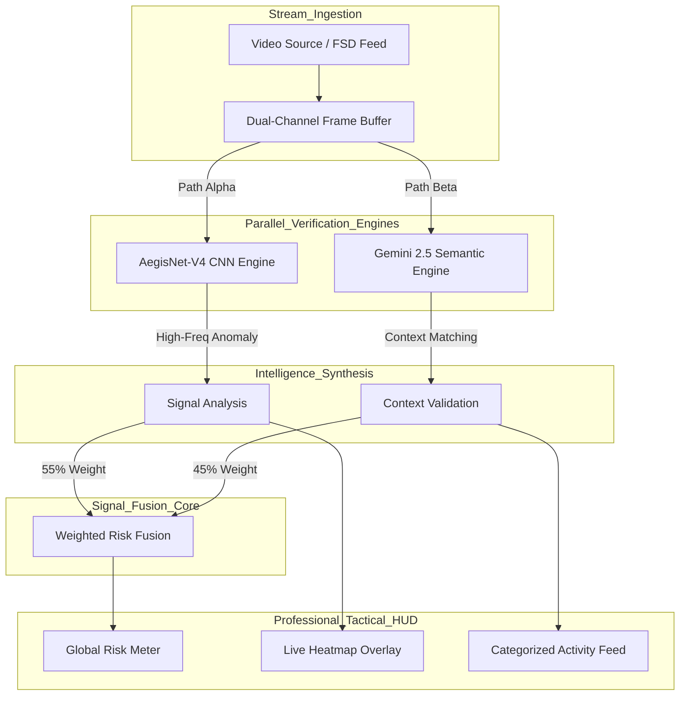
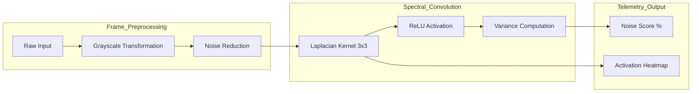
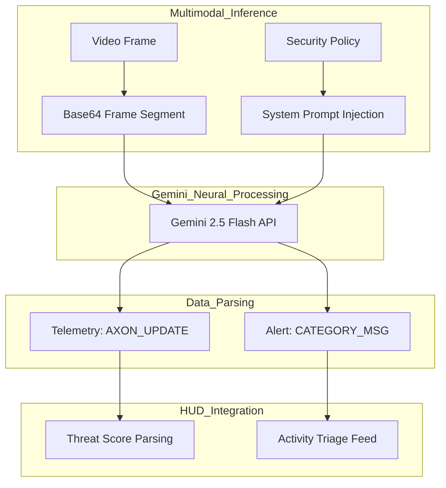

# AXON.SEC // Tactical Neural Defense Whitepaper
**Date:** 12/25/2025  
**Author:** Ritvik Indupuri

---

## Table of Contents
1. [01. Executive Summary](#01-executive-summary)
2. [02. Technical Infrastructure](#02-technical-infrastructure)
3. [03. Integrated Security Workflow](#03-integrated-security-workflow)
4. [04. Global System Architecture](#04-global-system-architecture)
5. [05. AegisNet-V4: Spectral CNN Engine](#05-aegisnet-v4-spectral-cnn-engine)
6. [06. Semantic Reasoning: Gemini 2.5 Architecture](#06-semantic-reasoning-gemini-25-architecture)
7. [07. Core Functional Modules & Feature Mechanics](#07-core-functional-modules--feature-mechanics)
    * [Video Ingestion & In-Memory Analysis](#video-ingestion--in-memory-analysis)
    * [Tactical HUD & Spectral Heatmapping](#tactical-hud--spectral-heatmapping)
    * [Security Telemetry: Risk Scoring & Stability Tracker](#security-telemetry-risk-scoring--stability-tracker)
    * [Governance Controls: Thresholds & Triage](#governance-controls-thresholds--triage)
8. [08. Conclusion](#08-conclusion)

---

## 01. Executive Summary
AXON.SEC is an industrial-grade cybersecurity framework designed to safeguard the vision stacks of autonomous mobility platforms. In a landscape where self-driving systems rely on neural perception, they are uniquely vulnerable to adversarial "optical malware"—patches or digital injections designed to deceive AI models. AXON.SEC addresses this by deploying a dual-verification defense layer. By fusing mathematical spectral analysis via a local CNN with high-level semantic reasoning via Gemini 2.5 Flash, the system ensures that vision data is both physically authentic and logically consistent.

## 02. Technical Infrastructure
The AXON.SEC platform is built on a high-concurrency architecture optimized for sub-millisecond telemetry updates and real-time inference.

*   **Logic Layer**: Google Gemini 2.5 Flash (Native Audio/Vision) for situational common-sense auditing.
*   **Spectral Layer**: TensorFlow.js running custom AegisNet-V4 kernels directly in the browser's WebGL context.
*   **Core Framework**: React 19 for modular component orchestration and state management.
*   **UI/UX HUD**: Tailwind CSS designed for high-contrast tactical readability.
*   **Data Streaming**: WebRTC and HTML5 MediaStream APIs for high-bandwidth frame ingestion.
*   **Visualization**: Recharts for temporal stability analysis and risk distribution.

## 03. Integrated Security Workflow
The platform operates as a continuous security loop. When a vision stream is ingested, the system extracts frames at a frequency synchronized with the analysis engine's capability. These frames are bifurcated into two separate processing pipelines: one for structural signal verification (CNN) and one for semantic logic validation (Gemini). The results are then synthesized into a unified risk metric, which triggers automated alerts and HUD updates.

## 04. Global System Architecture
The security pipeline is visualized below, highlighting the parallel nature of the defense mechanism. Data flows from the source through a dual-channel buffer, ensuring that both mathematical and logical checks happen simultaneously to maintain low-latency performance required for moving vehicles.

The Weighted Risk Fusion engine combines the Signal Health Score (the math) and the Context Logic Score (the meaning). A high noise score from the CNN indicates physical tampering, while a low logic score from Gemini indicates situational contradictions. Together, they provide a 360-degree security verdict.

## 05. AegisNet-V4: Spectral CNN Engine
AegisNet-V4 is a lightweight, edge-optimized convolutional network. Rather than classifying objects, it focuses on identifying "unnatural" mathematical patterns in the image signal.

The engine applies a Laplacian second-order spatial derivative to the frame. This mathematical process highlights discontinuities in intensity, effectively "stripping away" the semantic objects to reveal the underlying signal structure. Adversarial noise typically exists in frequencies that create high-variance clusters in this map. These clusters are then normalized into a Noise Score and projected onto the UI as a green activation map.

## 06. Semantic Reasoning: Gemini 2.5 Architecture
Situational logic is governed by the Gemini 2.5 Flash model. This engine serves as the "Common Sense" layer of the defense stack, detecting anomalies that a mathematical filter might ignore, such as a stop sign positioned in the middle of a high-speed highway lane.

The Gemini engine processes frame segments every 2 seconds. Using the provided System Instructions, it analyzes the scene for contradictions in road physics, signage placement, and object behavior. It returns structured telemetry that allows the HUD to categorize threats into specific risk buckets like 'Logic Error' or 'Manipulated Sign'.

## 07. Core Functional Modules & Feature Mechanics

### Video Ingestion & In-Memory Analysis
The platform supports high-bandwidth video ingestion via the **Upload Video** module. Once a file is selected, the browser creates a local blob URL, injecting the stream into a hidden canvas for pixel manipulation. This ensures that the original video data is never modified, maintaining forensic integrity. The analysis engine extracts 2 frames per second (FRAME_RATE = 2.0), striking an optimal balance between security coverage and browser performance.

### Tactical HUD & Spectral Heatmapping
The **Live Tactical HUD** is the primary interface for security analysts. The most critical component is the **Activation Heatmap**. By applying the Laplacian kernel's output to an RGBA canvas, the system generates a semi-transparent green glow over regions where the CNN detects high-frequency anomalies. Users can utilize the **Heatmap Opacity** slider to adjust the intensity of this layer, allowing them to visually correlate detected "noise" with physical objects like signs or camera lenses.

### Security Telemetry: Risk Scoring & Stability Tracker
Telemetry is unified into the **Overall Threat Risk** score. This is a dynamic calculation derived from:
*   **Context Logic Score (45%)**: How well the scene aligns with known safety rules.
*   **Signal Health Score (55%)**: The mathematical purity of the video data.

To monitor trends over time, the **Stability Tracker** provides a 30-second sliding window area chart. This visualization is essential for detecting "intermittent" attacks—sophisticated tampering that triggers only for a few frames to avoid detection by simpler, non-temporal filters.

### Governance Controls: Thresholds & Triage
The **System Config** panel allows operators to define the "Tripwires" for the defense stack.
*   **Threat Alert Slider**: Sets the sensitivity for semantic logic errors.
*   **Noise Alert Slider**: Sets the sensitivity for spectral interference.
When a score exceeds its threshold, a **CRITICAL** event is logged, and the HUD visual status shifts to a high-alert red state. These events are sorted in the **Activity Feed**, where users can filter by category to focus on specific attack vectors.

## 08. Conclusion
AXON.SEC represents a new paradigm in neural defense. By combining the sub-millisecond mathematical precision of the AegisNet-V4 CNN with the deep situational reasoning of Gemini 2.5 Flash, the framework provides a robust, verifiable security layer for the future of autonomous mobility. The integration of real-time heatmapping, temporal stability tracking, and adaptive governance ensures that autonomous systems are not just seeing the world, but verifying it.
