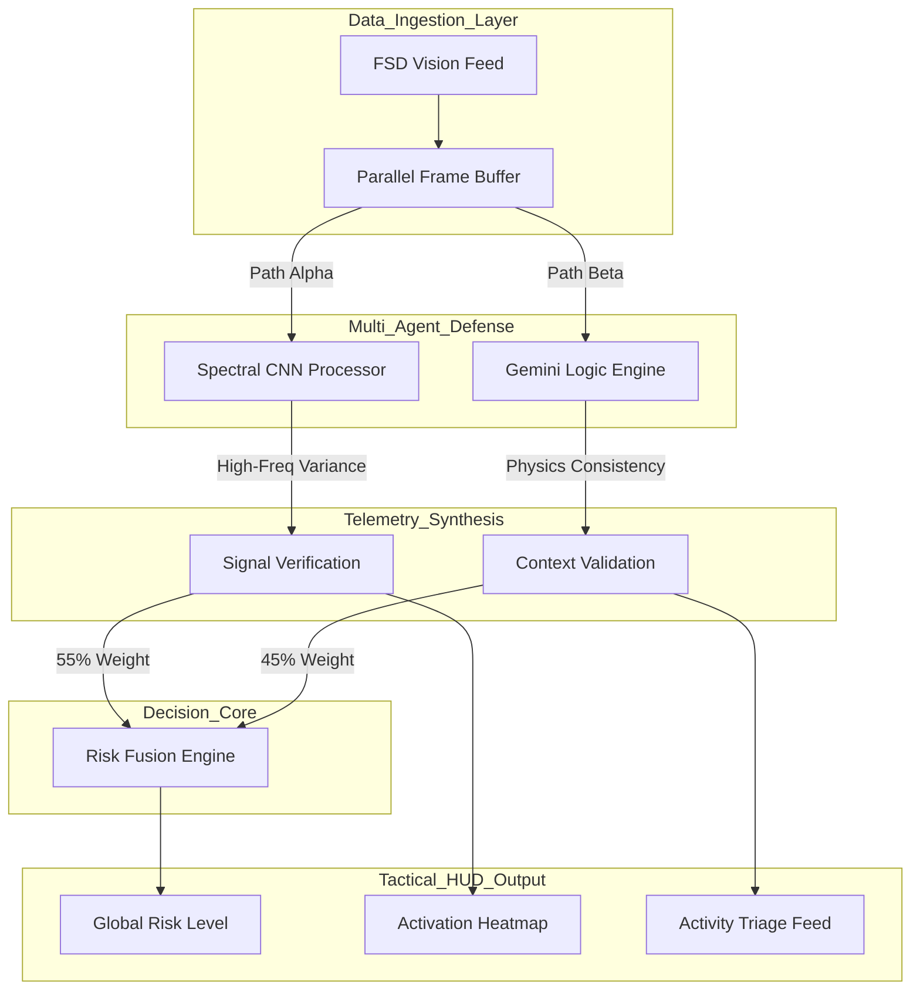
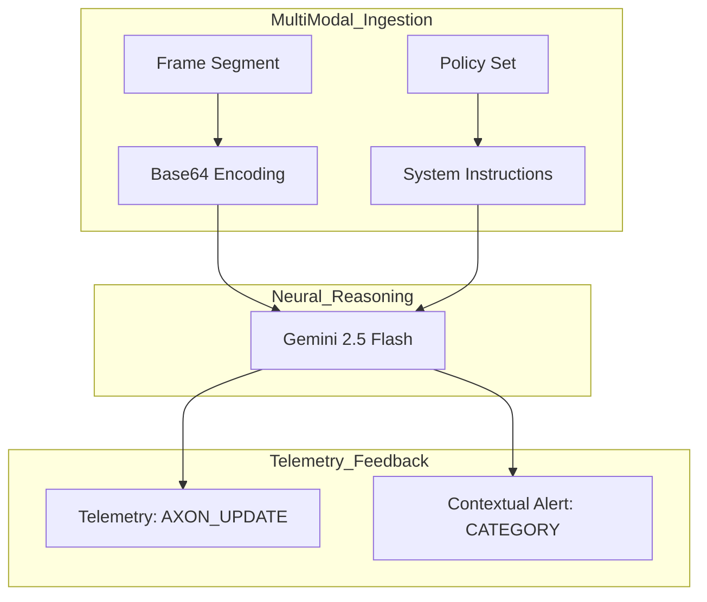

# AXON.SEC Technical Specification // High-Integrity FSD Defense
**Date:** 12/25/2025  
**Author:** Ritvik Indupuri

---

## Table of Contents
1. [1.0 Executive Summary](#10-executive-summary)
2. [2.0 Technical Infrastructure & Stack Selection](#20-technical-infrastructure--stack-selection)
    * [2.1 Frontend Orchestration & State Management](#21-frontend-orchestration--state-management)
    * [2.2 Real-Time Neural Inference Engines](#22-real-time-neural-inference-engines)
3. [3.0 Global System Architecture](#30-global-system-architecture)
    * [3.1 Data Ingestion & Dual-Channel Buffering](#31-data-ingestion--dual-channel-buffering)
    * [3.2 The Weighted Risk Fusion Engine](#32-the-weighted-risk-fusion-engine)
4. [4.0 Neural Verification Engines](#40-neural-verification-engines)
    * [4.1 Spectral CNN Engine: Signal Integrity Analysis](#41-spectral-cnn-engine-signal-integrity-analysis)
    * [4.2 Semantic Reasoning: Gemini 2.5 Logic Engine](#42-semantic-reasoning-gemini-25-logic-engine)
5. [5.0 Functional Module Mechanics](#50-functional-module-mechanics)
    * [5.1 Video Ingestion & Forensic Frame Extraction](#51-video-ingestion--forensic-frame-extraction)
    * [5.2 Tactical Computer Vision & Spectral Heatmapping](#52-tactical-computer-vision--spectral-heatmapping)
    * [5.3 Risk Level Metrics & Scoring Algorithm](#53-risk-level-metrics--scoring-algorithm)
    * [5.4 Stability Tracker & Temporal Anomaly Detection](#54-stability-tracker--temporal-anomaly-detection)
    * [5.5 Threat Summary & NLP Activity Triage](#55-threat-summary--nlp-activity-triage)
    * [5.6 System Configuration & Governance Controls](#56-system-configuration--governance-controls)
6. [6.0 Conclusion](#60-conclusion)

---

## 1.0 Executive Summary
AXON.SEC is an industrial-grade cybersecurity framework designed to safeguard the vision-processing pipelines of autonomous vehicles. In the context of Full Self-Driving (FSD), the "Perception Layer" is the most critical and vulnerable component of the vehicle's decision-making stack. Adversarial attacks—ranging from digital pixel perturbations to physical adversarial patches (high-frequency stickers on road signs)—can cause neural networks to misclassify objects with catastrophic results.

AXON.SEC addresses this by deploying a hybrid "Double-Lock" defense mechanism. It fuses mathematical signal verification (analyzing the raw pixels for unnatural frequencies) with high-level semantic reasoning (auditing the scene for logical physics errors). This document outlines the technical implementation of this multi-layered defense.

## 2.0 Technical Infrastructure & Stack Selection
The AXON.SEC platform is engineered for high-concurrency performance, ensuring that security analysis never introduces a bottleneck in the vehicle's FSD pipeline.

### 2.1 Frontend Orchestration & State Management
The application core is built on **React 19**, utilizing its optimized rendering engine to handle high-frequency telemetry updates (up to 60fps for the HUD). State is managed via modular hooks that separate the neural processing logic from the UI presentation layer, ensuring that the heavy lifting of frame analysis does not block the user interface.

### 2.2 Real-Time Neural Inference Engines
*   **Google Gemini 2.5 Flash**: Selected for its native multi-modal capabilities and low-latency inference. It acts as the "Context Logic" agent, interpreting complex visual scenes and auditing them against road-rule datasets.
*   **TensorFlow.js**: Provides the backbone for the **Spectral CNN Engine**. By running directly in the browser's WebGL context, AXON.SEC performs pixel-level convolutions at the edge, avoiding the latency of cloud-based visual signal processing.

## 3.0 Global System Architecture
The system architecture follows a parallel-processing paradigm designed to maintain 100% signal availability during analysis.

### 3.1 Data Ingestion & Dual-Channel Buffering
When a vision stream is ingested, it is cloned into a dual-channel buffer. Channel A feeds the Spectral CNN for structural verification, while Channel B feeds the Gemini Semantic Engine for logic verification. This ensures that a single frame is evaluated for both mathematical and logical integrity simultaneously.

**Figure 1: Global Multi-Agent Defense Architecture.** This diagram illustrates the flow from raw vision ingestion to the fusion of mathematical and semantic data. The Fusion Engine acts as the final arbitrator, calculating a weighted risk score that determines the vehicle's safety state.

### 3.2 The Weighted Risk Fusion Engine
The "Weighted Risk Fusion" is the mathematical core of AXON.SEC. It assigns a 55% weight to Signal Integrity (detected by the CNN) and a 45% weight to Contextual Logic (detected by Gemini). This weighting reflects the current threat landscape, where digital signal tampering is more common than complex physical logic errors.

## 4.0 Neural Verification Engines

### 4.1 Spectral CNN Engine: Signal Integrity Analysis
The Spectral Engine identifies adversarial perturbations by analyzing the mathematical texture of the image signal. Adversarial attacks often introduce high-frequency "noise" that is invisible to the human eye but confuses AI models.

**Figure 2: Spectral Convolution Pipeline.** The engine applies a **Laplacian Derivative Kernel** (a 3x3 matrix) to the frame. This mathematical operation calculates the second-order spatial derivative of the image, stripping away colors and objects to reveal only high-frequency edges and textures. By computing the statistical variance of this map, the system can pinpoint "unnatural" mathematical patterns.

### 4.2 Semantic Reasoning: Gemini 2.5 Logic Engine
The Semantic Logic engine uses Gemini 2.5 Flash to perform a situational "sanity check." It identifies errors that a mathematical filter might miss—such as an "invisible" road sign that has been logically repositioned to confuse a vehicle's navigation.

**Figure 3: Semantic Logic Validation Framework.** The engine analyzes frames for violations of road physics. The model is specifically instructed to look for contradictions like "Stop sign located in the center of an intersection" or "Speed limit sign with distorted numeric characters." The output is parsed into structured telemetry that informs the tactical HUD.

## 5.0 Functional Module Mechanics

### 5.1 Video Ingestion & Forensic Frame Extraction
The **Video Upload** module allows security analysts to ingest high-bandwidth FSD vision files. Once uploaded, AXON.SEC creates a temporary **Blob URL**, ensuring the original file is never altered. The extraction engine operates at **2.0 Frames Per Second (FPS)**. This specific cadence is selected to provide dense security coverage while allowing the Gemini engine sufficient compute cycles to perform deep semantic audits without falling behind the live stream.

### 5.2 Tactical Computer Vision & Heatmapping
The **Computer Vision** interface is a sophisticated HUD that overlays the CNN's activation data onto the raw video. 
*   **Heatmap Generation**: The output of the Laplacian convolution is mapped to an RGBA canvas where high-variance pixels are colored in a spectral green.
*   **Alpha Blending**: Users can control the **Heatmap Opacity** via a slider. This allows for real-time forensic correlation—analysts can see exactly which physical object (e.g., a specific speed limit sign) is triggering the "noise" alert by cross-referencing the green glow with the underlying footage.

### 5.3 Risk Level Metrics & Scoring Algorithm
The **Risk Level** is a high-level KPI that synthesizes the entire security landscape into a single percentage. 
*   **Signal Health Score**: Calculated by normalizing the variance from the Laplacian filter. 
*   **Context Logic Score**: Calculated based on the severity of contradictions identified by Gemini.
The algorithm produces a **THREAT_ALERT** if the combined risk exceeds operator-defined thresholds, shifting the interface from a "Secure" green state to a "Critical" red alert state.

### 5.4 Stability Tracker & Temporal Anomaly Detection
Adversarial attacks are often "flickering" or intermittent. The **Stability Tracker** provides a 30-second temporal window, visualizing the Risk Level as a continuous area chart. This temporal analysis is vital for identifying **Stochastic Attacks**, where a hacker injects noise for only 100ms at a time to remain below the detection threshold of simple frame-by-frame filters.

### 5.5 Threat Summary & NLP Activity Triage
The **Threat Summary** provides a natural language "security brief" of the current scene. Rather than just seeing a number, operators receive context such as: *"Detected high-frequency digital interference on the primary sensor; possible signal injection attempt."* This is supported by the **Activity Feed**, which triages every detection into categories:
*   **Manipulated Sign**: Physical tampering detection.
*   **Image Noise**: Spectral signal tampering.
*   **Logic Error**: Semantic contradiction detection.

### 5.6 System Configuration & Governance Controls
The **System Config** panel gives operators granular control over the "Tripwires" of the defense stack.
*   **Threat Alert Slider**: Calibrates the sensitivity to semantic logic errors.
*   **Noise Alert Slider**: Calibrates the sensitivity to spectral interference.
*   **Human-in-the-Loop**: By allowing operators to adjust these thresholds, AXON.SEC can be tuned for different environmental conditions (e.g., increasing noise tolerance during heavy rain while keeping logic sensitivity at maximum).

## 6.0 Conclusion
AXON.SEC represents a new frontier in FSD security. By merging the raw mathematical precision of spectral signal analysis with the sophisticated contextual reasoning of Gemini 2.5 Flash, the framework provides a robust, verifiable, and transparent defense layer. This hybrid architecture ensures that autonomous systems do not just "see" the world, but actively verify its integrity at every frame.
