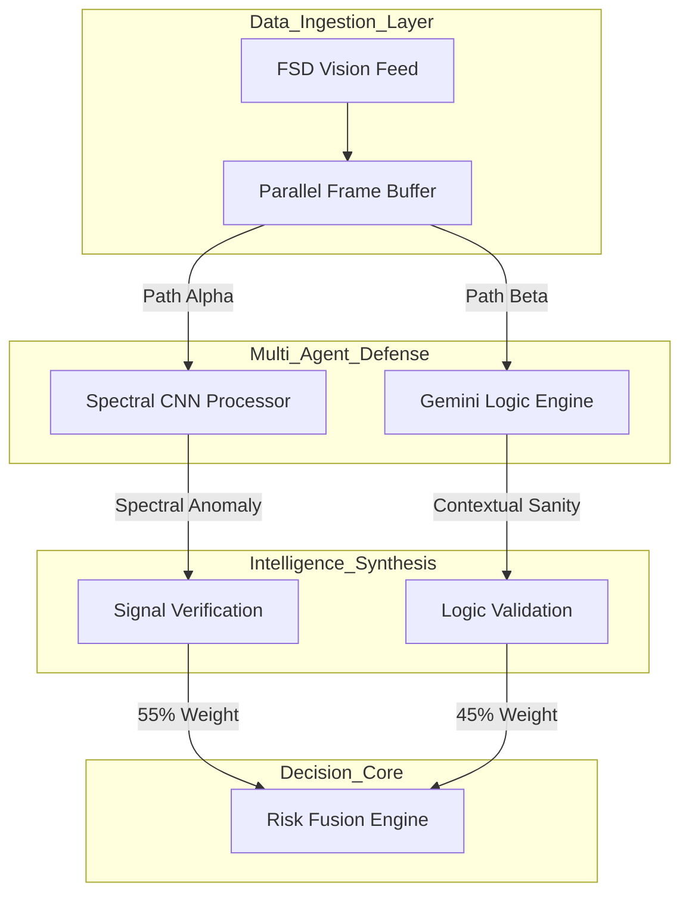
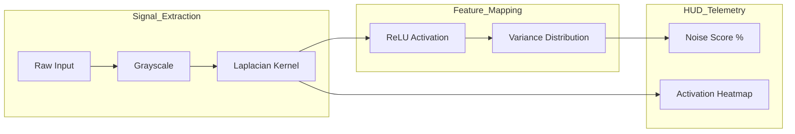
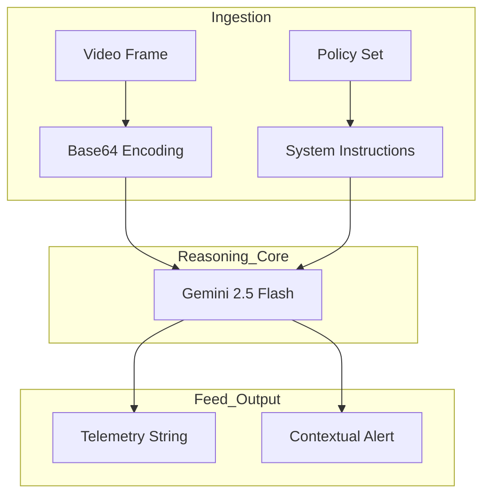

# AXON.SEC Technical Specification - High-Integrity Neural Defense
**Date:** 12/25/2025  
**Author:** Ritvik Indupuri

---

 

## Table of Contents
1.  [1.0 Executive Summary](#10-executive-summary)
2.  [2.0 System Objectives & Threat Modeling](#20-system-objectives--threat-modeling)
    *   [2.1 The FSD Perception Lifecycle](#21-the-fsd-perception-lifecycle)
    *   [2.2 Taxonomy of Visual Attacks](#22-taxonomy-of-visual-attacks)
3.  [3.0 Technical Infrastructure](#30-technical-infrastructure)
    *   [3.1 Application Core & State Management](#31-application-core--state-management)
    *   [3.2 WebGL-Accelerated Inference](#32-webgl-accelerated-inference)
4.  [4.0 Global Neural Architecture](#40-global-neural-architecture)
    *   [4.1 Parallel Multi-Agent Verification](#41-parallel-multi-agent-verification)
    *   [4.2 The Weighted Risk Fusion Engine](#42-the-weighted-risk-fusion-engine)
5.  [5.0 Spectral CNN Processor: The Signal Layer](#50-spectral-cnn-processor-the-signal-layer)
    *   [5.1 Mathematical Basis of Laplacian Convolution](#51-mathematical-basis-of-laplacian-convolution)
    *   [5.2 Frequency Anomaly Extraction](#52-frequency-anomaly-extraction)
6.  [6.0 Semantic Reasoning: The Logic Layer](#60-semantic-reasoning-the-logic-layer)
    *   [6.1 Multi-Modal Situational Auditing](#61-multi-modal-situational-auditing)
    *   [6.2 Physics-Based Logic Verification](#62-physics-based-logic-verification)
7.  [7.0 Functional Module Mechanics & Features](#70-functional-module-mechanics--features)
    *   [7.1 Video Ingestion & Forensic Frame Extraction](#71-video-ingestion--forensic-frame-extraction)
    *   [7.2 Tactical Computer Vision & Heatmapping HUD](#72-tactical-computer-vision--heatmapping-hud)
    *   [7.3 Risk Level Quantization & Metrics](#73-risk-level-quantization--metrics)
    *   [7.4 Stability Tracker & Temporal Analysis](#74-stability-tracker--temporal-analysis)
    *   [7.5 Threat Summary & NLP Triage](#75-threat-summary--nlp-triage)
    *   [7.6 System Configuration & Governance](#76-system-configuration--governance)
8.  [8.0 Conclusion](#80-conclusion)

---

 

## 1.0 Executive Summary
AXON.SEC is an industrial-grade cybersecurity platform engineered for the high-integrity verification of autonomous vehicle vision systems. In Full Self-Driving (FSD) stacks, the perception layer is the primary decision-making organ. AXON.SEC provides a "Double-Lock" defense mechanism that neutralizes adversarial optical malware—ranging from physical sign-tampering patches to digital signal injections—by fusing mathematical spectral analysis with high-level semantic reasoning. This document provides an exhaustive technical breakdown of the system architecture, mathematical kernels, and reasoning logic.

 

## 2.0 System Objectives & Threat Modeling

### 2.1 The FSD Perception Lifecycle
In a standard autonomous vehicle stack, vision data is ingested from CMOS sensors, pre-processed for noise, and fed into deep neural networks for object detection and path planning. AXON.SEC sits as a transparent proxy in this lifecycle, auditing the data before it reaches the decision-making layers. By analyzing the stream at the ingestion point, AXON.SEC can issue "halt" commands or sensor-invalid flags to the vehicle's drive controller if a perception breach is detected.

### 2.2 Taxonomy of Visual Attacks
The platform is specifically tuned to detect three primary categories of adversarial interference:
*   **Adversarial Patches**: High-frequency stickers placed on physical objects (like stop signs) that are mathematically designed to cause a neural network to misclassify the object while appearing benign to human observers.
*   **Signal Injection**: Digital noise added to the camera's video stream via sensor hacking, creating "ghost" obstacles or hiding actual hazards.
*   **Logic Exploits**: Manipulated visual environments that violate road physics (e.g., impossible shadows or floating signage) to confuse the vehicle's situational awareness.

 

## 3.0 Technical Infrastructure

### 3.1 Application Core & State Management
The platform is orchestrated using **React 19**, leveraging its optimized concurrent rendering engine. This allows the UI to maintain a consistent 60FPS while managing a high-bandwidth telemetry stream. Application state is handled via modularized React Hooks, separating the "Neural Inference Thread" from the "UI Presentation Thread" to prevent interface stuttering during heavy convolutional operations.

### 3.2 WebGL-Accelerated Inference
The **Spectral CNN Engine** is built on **TensorFlow.js**, utilizing the browser's WebGL backend. By performing convolutions directly on the GPU, AXON.SEC achieves sub-millisecond frame analysis, which is critical for the safety requirements of vehicles moving at highway speeds. This localized processing ensures that security analysis is not dependent on cloud latency.

 

## 4.0 Global Neural Architecture

### 4.1 Parallel Multi-Agent Verification
To ensure comprehensive security without introducing latency bottlenecks, AXON.SEC utilizes a parallel-processing pipeline. Raw vision data is bifurcated into two specialized processing channels.

  <strong>Figure 1: Global Parallel Processing Pipeline</strong>

This architecture ensures that the structural integrity of the signal is verified simultaneously with the logical consistency of the scene. The Risk Fusion Engine acts as the final arbitrator, calculating a weighted security score based on both mathematical and semantic evidence.

 

### 4.2 The Weighted Risk Fusion Engine
The "Weighted Risk Fusion" heuristic combines the raw mathematical signal health with the semantic logic verdict. Currently, the system is tuned with a **55% weight on Signal Integrity** and a **45% weight on Contextual Logic**. This prioritization recognizes that digital signal tampering is often a prerequisite for more complex semantic logic attacks. The resulting fusion score is used to trigger the vehicle's emergency safety protocols.

 

## 5.0 Spectral CNN Processor: The Signal Layer

### 5.1 Mathematical Basis of Laplacian Convolution
The Spectral Processor identifies structural anomalies by analyzing the high-frequency components of the image. This is achieved via a **Laplacian Kernel**, a 3x3 matrix that calculates the second-order spatial derivative of the image intensity.

  <strong>Figure 2: Spectral Feature Extraction Flow</strong>

By isolating the highest frequencies, the Laplacian kernel strips away the semantic "objects" and reveals the underlying signal structure. Adversarial noise appears as unnatural variance spikes in this high-frequency map. The kernel matrix `[[0,-1,0], [-1,4,-1], [0,-1,0]]` is specifically chosen for its sensitivity to point-noise and edge-distortions.

 

### 5.2 Frequency Anomaly Extraction
Once the high-frequency components are isolated, the system computes the statistical variance of the activation map. In a natural, non-tampered frame, the variance is distributed predictably. In an adversarial frame, the noise creates "mathematical clusters" that significantly deviate from the baseline. The **Spectral Anomaly Score** is calculated by normalizing this variance against a dynamic baseline calibrated for current environmental light conditions.

 

## 6.0 Semantic Reasoning: The Logic Layer

### 6.1 Multi-Modal Situational Auditing
The Logic Layer utilizes **Gemini 2.5 Flash** as a "Common Sense" auditor. While the CNN engine verifies the math of the pixels, Gemini verifies the meaning of the environment. It is tasked with identifying signage that violates road physics or object behaviors that contradict known safety parameters. This is achieved via a multi-modal prompt that includes the frame as a Base64 payload alongside instructions to audit situational consistency.

  <strong>Figure 3: Semantic Logic Framework</strong>

Gemini analyzes the scene for contradictions—such as a "Stop" sign positioned in the middle of a high-speed highway or a "Speed Limit" sign with distorted, non-standard fonts that could confuse a primary FSD model. The model is tuned for high-precision, low-recall to avoid false positives in complex urban environments.

 

### 6.2 Physics-Based Logic Verification
The Gemini engine communicates via structured telemetry strings (e.g., `[AXON_UPDATE]`). This allows AXON.SEC to quantify high-level AI reasoning into a numerical **Context Logic Score**. This score accounts for spatial inconsistencies, impossible lighting patterns, and object behaviors that defy the laws of kinematics—all indicators that the visual feed has been logically manipulated or injected.

 

## 7.0 Functional Module Mechanics & Features

### 7.1 Video Ingestion & Forensic Frame Extraction
The **Video Upload** module handles the ingestion of high-bandwidth FSD vision files. To maintain forensic integrity, the platform creates an in-memory blob and never writes temporary data to the disk. Frames are extracted at **2.0 FPS**, a rate specifically selected to balance dense security coverage with the compute requirements of the Gemini reasoning engine. This ensuring that no single frame of an adversarial flickering attack remains unanalyzed for more than 500ms.

 

### 7.2 Tactical Computer Vision & Heatmapping HUD
The **Computer Vision HUD** provides analysts with a live visual diagnostic. The output of the Laplacian filter is normalized and projected as a semi-transparent green overlay. Analysts can adjust the **Heatmap Opacity** to correlate detected spectral noise with physical objects in the video. This feature is vital for "Human-in-the-Loop" verification, allowing an operator to see a neon-green glow over tampered road signs.

 

### 7.3 Risk Level Quantization & Metrics
The **Risk Level** is the system's primary KPI. It is a synthesized percentage derived from:
*   **Signal Health (55%)**: The mathematical purity of the pixel data.
*   **Context Logic (45%)**: The situational "sanity" of the scene.
If the combined risk exceeds the operator's thresholds, the HUD shifts into a high-alert state, triggering red visual signals and logging a **CRITICAL** threat event in the permanent mission log.

 

### 7.4 Stability Tracker & Temporal Analysis
Because many adversarial attacks are designed to "flicker" and evade static detection, AXON.SEC includes a **Stability Tracker**. This Recharts-powered area chart monitors the Risk Level over a 30-second sliding window. This temporal visualization allows analysts to identify patterns of intermittent digital injection or physical masking that a single-frame auditor would classify as random sensor noise.

 

### 7.5 Threat Summary & NLP Triage
The **Threat Summary** provides a natural language security brief of the current scene, powered by Gemini's textual modality. It translates raw telemetry into actionable insights, such as: *"High probability of sign tampering detected on the 300m stop sign; spectral noise exceeds safety thresholds."* Every detection is automatically categorized in the **Activity Feed** for rapid forensic triage and automated reporting.

 

### 7.6 System Configuration & Governance
The **System Config** panel gives operators granular control over the defense stack's tripwires. Through the **Threat Alert** and **Noise Alert** sliders, the system can be calibrated for different environmental variables. For example, in rainy conditions where natural signal noise is higher, an operator can increase the noise threshold while maintaining maximum logic sensitivity to protect against complex adversarial attacks.

 

## 8.0 Conclusion
AXON.SEC represents a paradigm shift in autonomous vehicle security. By merging the pixel-level precision of spectral signal analysis with the human-like situational reasoning of Gemini 2.5 Flash, the framework provides a robust, verifiable, and transparent defense layer. This hybrid architecture ensures that Full Self-Driving systems can operate with a high degree of confidence in the absolute integrity of their perception data, even in the presence of sophisticated adversarial actors.
