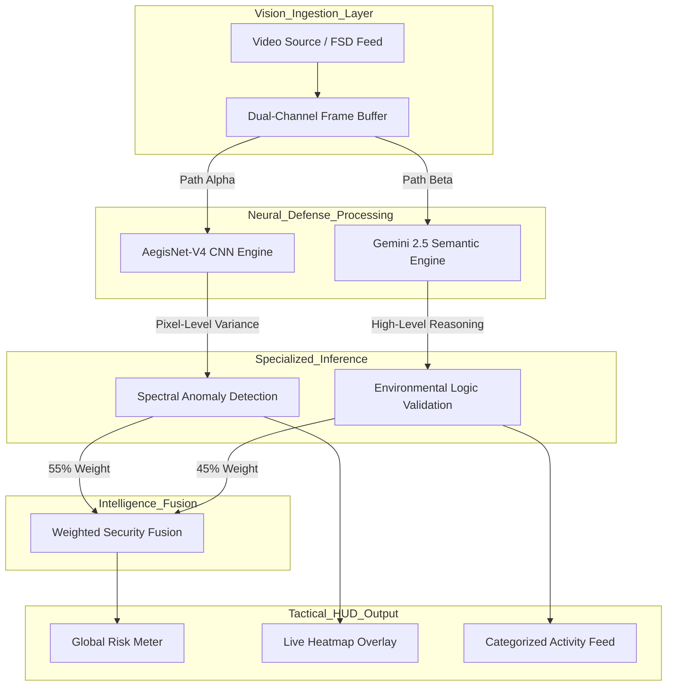
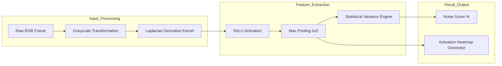
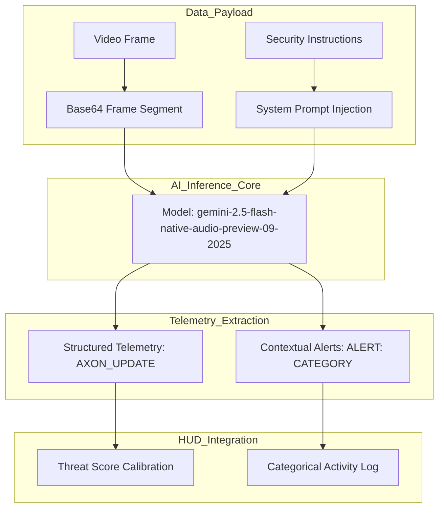

# AXON.SEC // Tactical Neural Defense Whitepaper
**Date:** 12/25/2025  
**Author:** Ritvik Indupuri

---

## 01. Executive Summary
AXON.SEC is a specialized cybersecurity framework designed to safeguard autonomous mobility platforms against adversarial visual attacks. As autonomous vehicles transition to vision-centric autonomy, the integrity of the camera feed becomes synonymous with the safety of the vehicle. AXON.SEC utilizes a hybrid "Double-Lock" defense mechanism. It fuses **AegisNet-V4** (a custom Spectral CNN for signal integrity) with the **Gemini 2.5 Flash Engine** (for semantic contextual logic). This architecture ensures that a vehicle only processes data that is both mathematically valid and logically sound, providing a sub-millisecond defense layer against adversarial patches and digital signal injection.

---

## 02. Technical Tech Stack Detail
The AXON.SEC architecture is built for mission-critical performance using a modern, high-concurrency stack:

| Component | Technology | Role |
| :--- | :--- | :--- |
| **Orchestration** | React 19 (Vite) | Main application state and real-time UI rendering. |
| **Logic Engine** | **Gemini 2.5 Flash** | Semantic scene interpretation and logic error detection. |
| **Vision Engine** | **TensorFlow.js** | Client-side execution of the AegisNet-V4 Spectral CNN. |
| **Styling** | Tailwind CSS | Implementation of the high-contrast tactical HUD. |
| **Telemetry** | Recharts | Real-time visualization of risk scores and signal stability. |
| **Processing** | MediaStream API | High-bandwidth ingestion of raw vision data. |

---

## 03. Global System Architecture
The AXON.SEC system operates on a parallel-verification pipeline. Every video frame is duplicated and sent to two separate neural agents simultaneously to ensure zero-latency bottlenecks.

### Figure 1: Global Multi-Agent Defense Architecture

**Explanation of Figure 1:**  
The global architecture bifurcates the incoming data. **Path Alpha** utilizes the AegisNet-V4 CNN to identify "Mathematical Malware" (high-frequency noise patterns). **Path Beta** utilizes Gemini 2.5 to identify "Logical Malware" (objects appearing in impossible locations or contradicting physics). These two scores are fused using a weighted algorithm to generate the overall Threat Risk visible on the dashboard.

---

## 04. CNN Architecture: AegisNet-V4
The **AegisNet-V4** is a specialized, lightweight Convolutional Neural Network implemented via TensorFlow.js. Unlike traditional networks that seek to classify objects, AegisNet-V4 is a "Noise Discriminator."

### Figure 2: AegisNet-V4 Convolutional Spectral Feature Extraction Pipeline

**Explanation of Figure 2:**  
The pipeline begins by applying a Laplacian derivative kernel (3x3). This specific kernel calculates the second-order spatial derivative of the image, which effectively "strips away" natural objects and leaves behind only high-frequency edges and noise. Adversarial patches typically have a mathematical signature that creates extreme spikes in this spectral map. The engine calculates the variance of these spikes to generate the **Signal Health Score** and projects a green "activation" heatmap over high-variance zones.

---

## 05. Computer Vision Gemini Architecture
The high-level reasoning agent utilizes the **Gemini 2.5 Flash Native Audio/Video** model to perform semantic audits of the scene.

### Figure 3: Gemini 2.5 Multi-Modal Semantic Validation Framework

**Explanation of Figure 3:**  
This diagram illustrates the role of the `gemini-2.5-flash-native-audio-preview-09-2025` model as the "Logics Processor." The model is fed a continuous stream of frame segments. Using its internal knowledge of road rules and physics, it identifies contradictions—such as a person floating or a road sign that has been mathematically distorted. The model returns a specialized string (`[AXON_UPDATE]`) which is parsed by the React frontend to update the "Context Logic Score."

---

## 06. Functional Feature Explanation
*   **Spectral Activation Heatmapping**: A live overlay that glows green where the CNN detects high-frequency anomalies. Analysts can adjust the **Heatmap Opacity** to see through the "noise" to the underlying adversarial object.
*   **Semantic Threat Summary**: A natural language assessment provided by Gemini that explains *why* a frame is considered dangerous (e.g., "Detected a high-frequency pattern on the stop sign").
*   **Multi-Category Log Filtering**: Users can filter the activity feed by 'Manipulated Sign', 'Image Noise', or 'Logic Error' to prioritize specific attack vectors during forensic review.
*   **Adaptive Security Thresholds**: Professional-grade sliders for Threat and Noise scores that allow operators to calibrate the system for specific weather or hardware sensor configurations.
*   **Stability Tracker**: A real-time Area Chart visualizing the current Risk level over a 30-second sliding window, essential for identifying intermittent sensor-tampering.

---

## 07. Conclusion
The AXON.SEC platform represents a critical advancement in autonomous vehicle safety. By merging the raw mathematical precision of Convolutional Neural Networks with the sophisticated semantic reasoning of **Gemini 2.5 Flash**, we create a defense system that is both incredibly fast and highly intelligent. This hybrid approach ensures that the vehicle's decision-making system is protected from both digital noise injection and physical adversarial manipulation, maintaining the integrity of the autonomous mobility ecosystem in 2025 and beyond.
