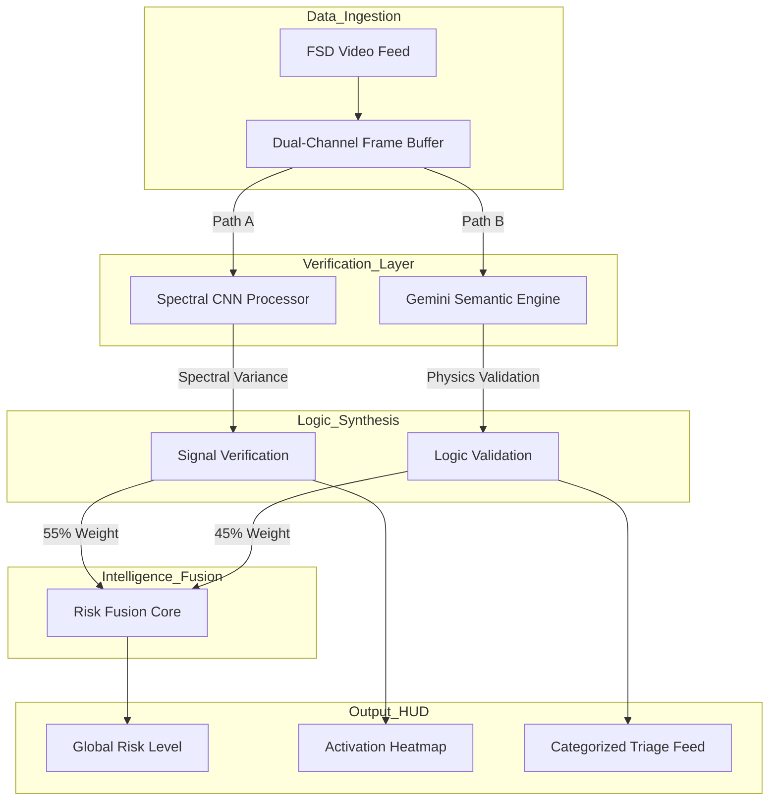
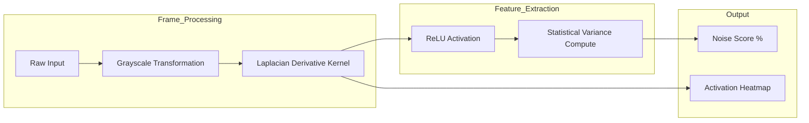
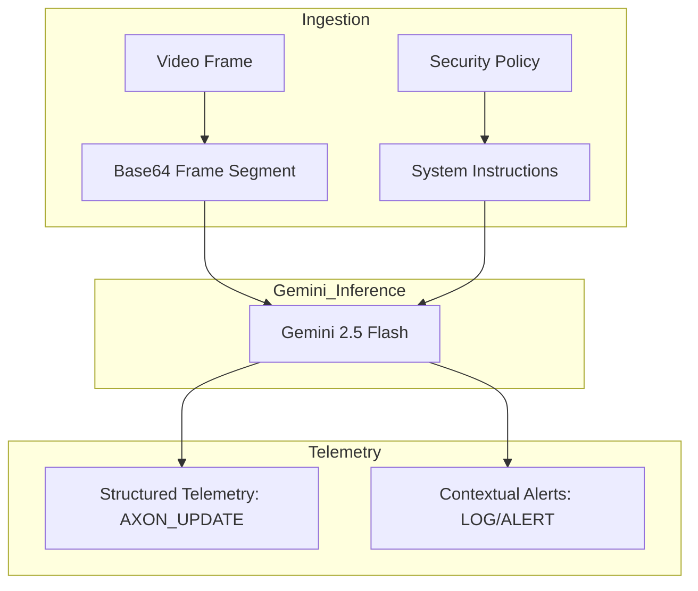

# AXON.SEC Technical Specification
**Date:** 12/25/2025  
**Author:** Ritvik Indupuri

---

## Table of Contents
1. [1.0 Executive Summary](#10-executive-summary)
2. [2.0 Technical Infrastructure](#20-technical-infrastructure)
3. [3.0 Global System Architecture](#30-global-system-architecture)
4. [4.0 Neural Verification Engines](#40-neural-verification-engines)
    * [4.1 Spectral CNN Engine: Signal Integrity](#41-spectral-cnn-engine-signal-integrity)
    * [4.2 Semantic Reasoning: Gemini Logic Engine](#42-semantic-reasoning-gemini-logic-engine)
5. [5.0 Functional Module Mechanics](#50-functional-module-mechanics)
    * [5.1 Video Ingestion & Frame Extraction](#51-video-ingestion--frame-extraction)
    * [5.2 Tactical Computer Vision & Heatmapping](#52-tactical-computer-vision--heatmapping)
    * [5.3 Risk Level Metrics & Scoring Algorithm](#53-risk-level-metrics--scoring-algorithm)
    * [5.4 Stability Tracker & Temporal Analysis](#54-stability-tracker--temporal-analysis)
    * [5.5 Threat Summary & Activity Logging](#55-threat-summary--activity-logging)
    * [5.6 System Configuration & Governance](#56-system-configuration--governance)
6. [6.0 Conclusion](#60-conclusion)

---

## 1.0 Executive Summary
AXON.SEC is a specialized security framework designed to safeguard autonomous mobility systems from adversarial perception attacks. By deploying a hybrid defense-in-depth model, the system ensures that vision data—the primary input for Full Self-Driving (FSD) decision-making—is mathematically valid and logically sound. This platform neutralizes adversarial "patches" and digital signal injections that seek to compromise the safety of autonomous vehicles.

## 2.0 Technical Infrastructure
The AXON.SEC platform utilizes a high-concurrency architecture optimized for real-time edge inference.

*   **Logic Engine**: Google Gemini 2.5 Flash provides high-level semantic auditing via multi-modal analysis.
*   **Spectral Engine**: TensorFlow.js executes custom convolutional kernels directly in the browser’s WebGL context for sub-millisecond signal verification.
*   **Framework**: React 19 manages complex application state and high-frequency UI updates.
*   **HUD Design**: Tailwind CSS provides a high-contrast, tactical interface for security analysts.
*   **Telemetry**: Recharts visualizes high-frequency risk scores and temporal signal stability.

## 3.0 Global System Architecture
The system operates on a parallel-verification pipeline. Every video frame is bifurcated into two separate processing channels. This ensures that the structural integrity of the signal is verified simultaneously with the logical consistency of the scene, maintaining the low-latency requirements of a moving vehicle.

**Figure 1: Global Multi-Agent Defense Architecture.** As demonstrated above, the architecture synthesizes raw mathematical pixel analysis (Path A) with sophisticated semantic reasoning (Path B). The Risk Fusion Core combines these inputs to generate a unified security verdict for the vehicle's Safety Control Unit.

## 4.0 Neural Verification Engines

### 4.1 Spectral CNN Engine: Signal Integrity
The Spectral Engine is a custom convolutional neural network designed for high-frequency anomaly detection. It identifies mathematical "noise" often found in adversarial images.

**Figure 2: Spectral Convolution Pipeline.** The engine utilizes a Laplacian derivative kernel to calculate the second-order spatial derivative of the frame. This process effectively isolates the edges and noise textures, stripping away the semantic content. By calculating the variance of these high-frequency components, the system detects digital perturbations. Areas with high variance are projected onto the HUD as a green activation heatmap.

### 4.2 Semantic Reasoning: Gemini Logic Engine
The Semantic Logic engine uses the Gemini 2.5 Flash model as a "sanity check." It identifies situational contradictions that pixel-level filters cannot catch.

**Figure 3: Semantic Logic Validation Framework.** The engine analyzes frames for violations of road physics or signage placement. If a stop sign is detected in an impossible location (e.g., hanging in mid-air or mathematically distorted), the Gemini model issues an `AXON_UPDATE` telemetry string, which is parsed by the UI to calibrate the Context Logic Score.

## 5.0 Functional Module Mechanics

### 5.1 Video Ingestion & Frame Extraction
The platform handles high-bandwidth vision ingestion via a dedicated **Video Upload** system. Once a file is provided, AXON.SEC creates an in-memory blob to preserve forensic integrity. Frames are extracted at a frequency of 2.0 FPS, ensuring that the neural engines have sufficient data to detect transient attacks without overwhelming system resources.

### 5.2 Tactical Computer Vision & Heatmapping
The **Computer Vision** interface provides analysts with a live overlay of the CNN's output. The **Activation Heatmap** serves as a visual diagnostic tool, glowing green where high-frequency spectral anomalies are detected. Using the **Heatmap Opacity** slider, analysts can visually correlate these anomalies with specific objects in the video, such as road signs or lane markings that may have been physically tampered with.

### 5.3 Risk Level Metrics & Scoring Algorithm
The **Risk Level** is the primary telemetry metric. It is calculated using a weighted synthesis:
*   **Signal Health (55%)**: Derived from the Spectral CNN's variance analysis. Higher variance indicates digital injection or sensor tampering.
*   **Context Logic (45%)**: Derived from the Gemini engine's semantic audit. Higher threat levels indicate situational contradictions or adversarial patches.
When the combined risk exceeds the set thresholds, the system shifts into a **CRITICAL** status, triggering red visual alerts on the HUD.

### 5.4 Stability Tracker & Temporal Analysis
Because adversarial attacks can be intermittent (flickering for only a few frames to evade detection), AXON.SEC includes a **Stability Tracker**. This area chart monitors the Risk Level over a 30-second sliding window. This temporal analysis allows security teams to identify subtle patterns of interference that are not obvious in single-frame snapshots.

### 5.5 Threat Summary & Activity Logging
The **Threat Summary** module uses the Gemini engine to generate a natural language explanation of the current security landscape. This provides context to the raw numbers, explaining *why* a frame is considered a risk. This is paired with the **Activity Feed**, which triages every detection into categories such as 'Manipulated Sign', 'Image Noise', or 'Logic Error', facilitating rapid response.

### 5.6 System Configuration & Governance
The **System Config** panel provides professional-grade calibration tools. Through the **Threat Alert** and **Noise Alert** sliders, operators can adjust the sensitivity of the defense stack to account for environmental factors like heavy rain (which increases natural noise) or urban complexity.

## 6.0 Conclusion
AXON.SEC represents a critical leap in FSD security. By merging the mathematical precision of spectral signal analysis with the sophisticated contextual reasoning of Gemini 2.5 Flash, the platform provides a verifiable and transparent defense layer. This hybrid approach ensures that autonomous systems can operate with a high degree of confidence in the integrity of their vision data.
