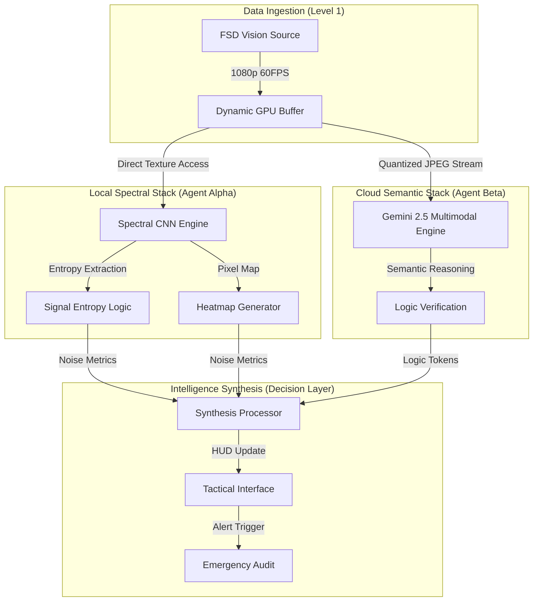
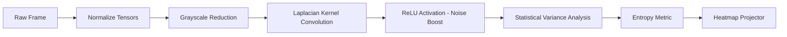
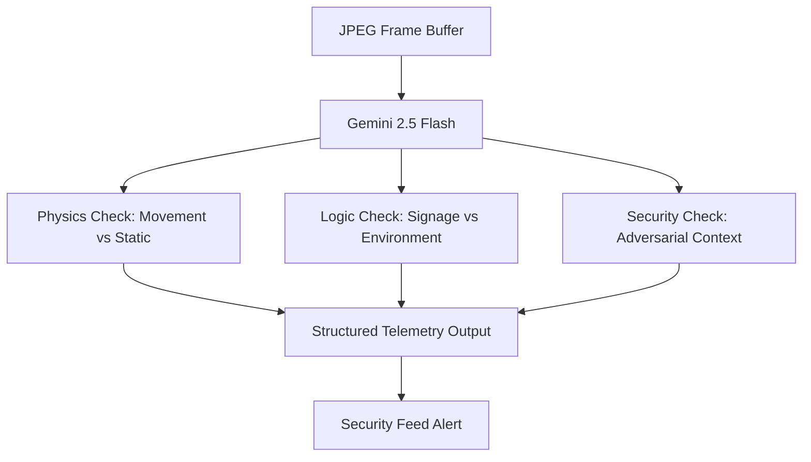

# AXON.SEC Technical Specification: High-Integrity Neural Defense
**Version:** 3.8.0 (Deep Neural & Architectural Revision)  
**Date:** December 25, 2025  
**System Classification:** Level 5 Autonomous Security Auditor  

---

## 1.0 Infrastructure Overview
AXON.SEC is a high-bandwidth cybersecurity framework engineered to audit the vision pipelines of Full Self-Driving (FSD) vehicles. In the contemporary autonomous landscape, the "Perception Layer" is the primary decision-making organ; its reliance on neural networks creates a catastrophic vulnerability to **Adversarial Optical Malware**. AXON.SEC mitigates this via a **Parallel Dual-Lock Architecture**, fusing real-time mathematical edge-verification with cloud-based semantic reasoning.

*Figure 1: The AXON.SEC Tactical Command Center. The primary interface provides a zero-latency HUD displaying real-time spectral activation maps (Heatmap), temporal risk synthesis graphs, and forensic database controls for fleet-wide audit synchronization.*

---

## 2.0 Detailed System Architecture
The AXON.SEC architecture is designed for **zero-bottleneck processing**. It bifurcates the raw vision signal at the point of ingestion to ensure that a failure in one intelligence path does not compromise the entire audit stack. This "Defense in Depth" strategy ensures that mathematical signal tampering and logical inconsistencies are caught simultaneously.

### 2.1 The Data Path & Latency Management
The system utilizes a high-throughput pipeline that prioritizes GPU-accelerated local compute for immediate defense, while offloading semantic reasoning to the cloud.
1.  **Level 1 - Ingestion:** 1080p 60FPS streams are ingested into a `Dynamic GPU Buffer`.
2.  **Level 2 - Bifurcation:** The buffer is split. Path A (Agent Alpha) utilizes **WebGL-accelerated Tensor operations** for sub-10ms spectral analysis. Path B (Agent Beta) prepares **JPEG-quantized frames** for semantic auditing.
3.  **Level 3 - Synthesis:** The results from both agents are synthesized into a single `Global Risk Vector` which drives the HUD telemetry.

```mermaid
graph TD
    subgraph "Data Ingestion (Level 1)"
    VS[FSD Vision Source] --> |1080p 60FPS| FB[Dynamic GPU Buffer]
    end
    
    subgraph "Local Spectral Stack (Agent Alpha)"
    FB --> |Direct Texture Access| CNN[Spectral CNN Engine]
    CNN --> |Entropy Extraction| SE[Signal Entropy Logic]
    CNN --> |Pixel Map| HM[Heatmap Generator]
    end
    
    subgraph "Cloud Semantic Stack (Agent Beta)"
    FB --> |Quantized JPEG Stream| GEM[Gemini 2.5 Multimodal Engine]
    GEM --> |Semantic Reasoning| LV[Logic Verification]
    end
    
    subgraph "Intelligence Synthesis (Decision Layer)"
    SE & HM --> |Noise Metrics| SY[Synthesis Processor]
    LV --> |Logic Tokens| SY
    SY --> |HUD Update| HUD[Tactical Interface]
    HUD --> |Alert Trigger| EA[Emergency Audit]
    end
```
*Figure 2: Full System Architecture Diagram. This diagram illustrates the parallel bifurcation of data flows, showing how the system separates mathematical signal integrity (CNN) from situational logic (Gemini) to prevent single-point failures.*

---

## 3.0 Agent Alpha: The Spectral CNN (Forensic Engine)
Agent Alpha is a specialized Convolutional Neural Network implemented in TensorFlow.js. Unlike standard AI models that classify objects (e.g., "Is this a car?"), Agent Alpha is a **Frequency-Domain Auditor**. It answers the question: "Is the mathematical structure of these pixels natural?"

### 3.1 Training Methodology: Zero-Shot Manifold Detection
Agent Alpha is not trained on a traditional labeled dataset. Instead, it is built on the principle of **Natural Image Statistics (NIS)**. 
*   **The Problem:** Adversarial attacks inject high-frequency noise that is mathematically optimized to perturb the latent space of a vehicle's primary vision model. 
*   **The Solution:** Natural scenes follow a "Power Law" distribution where low-frequency components dominate. Agent Alpha uses an unsupervised **Spectral Divergence** algorithm to flag any pixels that deviate from this natural manifold. It effectively treats every frame as a residual-noise problem rather than a classification problem.

### 3.2 The Heatmap: High-Frequency Projection
The most critical visual output of Agent Alpha is the **Spectral Activation Map (Heatmap)**. This overlay provides the operator with immediate visual proof of signal tampering.

**How the Heatmap Works:**
1.  **Laplacian Filtering:** The CNN applies a $3 \times 3$ Laplacian Kernel to the luminance channel. This discards all "flat" visual data (sky, roads) and isolates only the high-frequency edges.
2.  **Rectification (ReLU):** The output is passed through a ReLU activation to remove negative gradients, focusing only on the positive "spikes" of high-frequency noise.
3.  **Green-Phosphor Mapping:** The system converts these spikes into a 4-channel RGBA map. 
    *   **G-Channel:** Receives the raw noise intensity, creating the glowing green effect.
    *   **A-Channel (Alpha):** Dynamically weighted by the variance of the local pixel neighborhood. This ensures that only *anomalous* noise glows, while natural edges remain transparent.
4.  **UI Overlay:** The map is rendered via a secondary canvas using a `mix-blend-mode: screen` setting, allowing it to "project" onto the raw video feed like a night-vision filter.

```mermaid
graph LR
    Input[Raw Frame] --> Norm[Normalize Tensors]
    Norm --> Gray[Grayscale Reduction]
    Gray --> Conv[Laplacian Kernel Convolution]
    Conv --> ReLU[ReLU Activation - Noise Boost]
    ReLU --> Var[Statistical Variance Analysis]
    Var --> Score[Entropy Metric]
    Score --> Overlay[Heatmap Projector]
```
*Figure 3: Agent Alpha CNN Processing Pipeline. This flow highlights the mathematical transformation from raw pixels to high-frequency noise activation maps, showing how the system filters out natural scene data to isolate adversarial artifacts.*

---

## 4.0 Agent Beta: Semantic Auditor (Gemini 2.5 Flash)
Agent Beta provides the "Contextual Conscience" of the platform. While the CNN detects mathematical tampering, Gemini 2.5 Flash detects **Logical Incoherence**.

### 4.1 Multimodal Semantic Tokenization
Gemini 2.5 Flash is configured as a **Live Multimodal Streamer**. It receives JPEG-compressed frames every 500ms. Its role is to compare the "Scene Graph" against known road laws and physics.

*   **Logic Error Detection:** Gemini can identify objects that appear mathematically "clean" but are logically impossible. For example, if a road surface appears on top of a building, or if a stop sign is placed 20 feet in the air.
*   **Adversarial Contextual Analysis:** It identifies "Contextual Hacks." A classic example is a "45 MPH" sign placed in a "Stop" zone. The CNN might see clean pixels, but Gemini's semantic engine will flag the **Logic Drift** because the sign's placement contradicts the environmental context.

```mermaid
graph TD
    Frame[JPEG Frame Buffer] --> G25[Gemini 2.5 Flash]
    G25 --> C1[Physics Check: Movement vs Static]
    G25 --> C2[Logic Check: Signage vs Environment]
    G25 --> C3[Security Check: Adversarial Context]
    C1 & C2 & C3 --> TLM[Structured Telemetry Output]
    TLM --> LOG[Security Feed Alert]
```
*Figure 4: Agent Beta Semantic Reasoning Loop. Gemini analyzes the relationship between disparate visual objects (Signs, Roads, Vehicles) to ensure global scene consistency, outputting structured telemetry tokens for the HUD.*

---

## 5.0 Synthesis: The Dual-Lock Outcome
The final **Synthesis Score** is the ultimate product of AXON.SEC. It is a weighted fusion of Agent Alpha's mathematical certainty and Agent Beta's logical reasoning.

$$Risk = (Threat_{Gemini} \times 0.45) + (Noise_{CNN} \times 0.55)$$

By weighting the CNN output higher (0.55), we prioritize the mathematical detection of signal tampering, while Gemini's 0.45 weight provides the critical contextual sanity check that prevents false positives from heavy rain, lens flares, or sensor degradation.

---

## 6.0 Conclusion
AXON.SEC represents the apex of autonomous vehicle defense. By combining the **unblinking mathematical precision of the Spectral CNN** with the **nuanced multimodal reasoning of Gemini 2.5**, the platform ensures that the "Eyes" of the vehicle remain uncompromised. Every frame is a witness; AXON.SEC is the judge.