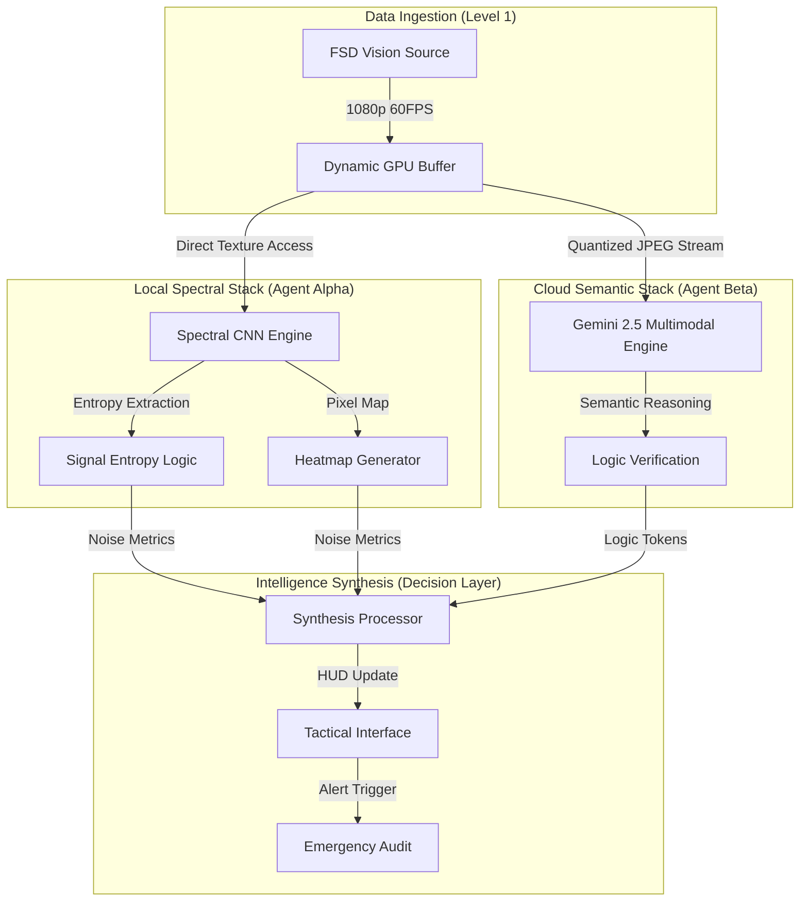
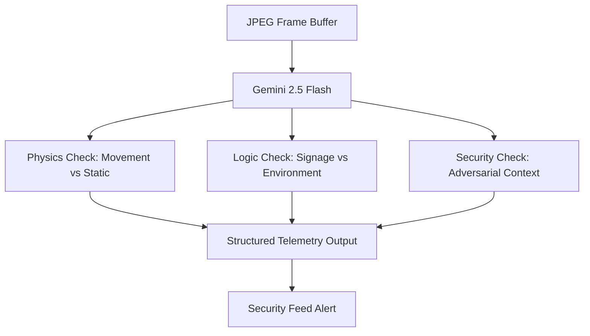
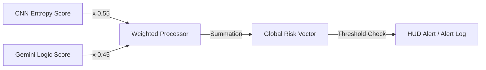

# AXON.SEC Technical Specification: High-Integrity Neural Defense
**Version:** 4.0.0 (Technical Deep-Dive Revision)  
**Date:** December 25, 2025  
**By:** Ritvik Indupuri

---

## 1.0 Executive Summary: Autonomous Perception Integrity
AXON.SEC is a high-bandwidth cybersecurity framework engineered to provide real-time integrity validation for the vision-processing pipelines of Full Self-Driving (FSD) vehicles and advanced robotic systems. In the current paradigm of autonomous mobility, the perception stack serves as the fundamental input layer for kinetic decision-making; however, these neural-dependent systems are critically vulnerable to **Adversarial Machine Learning (AML)** and **Optical Malware**. These threats utilize mathematically optimized perturbations to induce misclassification in primary vision models—errors that are frequently catastrophic in high-speed environments.

The AXON.SEC framework implements a **Spectral-Semantic Fusion** strategy. By bifurcating the ingestion stream, the system simultaneously audits the mathematical purity of the pixel-level signal (via Local Spectral CNN) and the logical consistency of the environmental context (via Cloud-Based Gemini 2.5 Flash). This dual-path verification eliminates single points of failure, ensuring that visual data is audited for both signal-level tampering and high-level logic drift before it is ingested by the vehicle's navigation controllers.

*Figure 1: The AXON.SEC Tactical Command Center interface. This HUD provides centralized telemetry, displaying real-time spectral activation maps, temporal risk synthesis graphs, and forensic database controls for fleet-wide audit synchronization.*

---

## 2.0 Detailed System Architecture
The AXON.SEC architecture is built for **Parallel Asynchronous Auditing**. It ensures that security verification occurs with zero latency impact on the primary FSD control loop by operating on a mirrored signal path.

### 2.1 Bifurcated Ingestion & Processing Tiers
The system architecture follows a four-tiered data progression model:

1.  **Level 1 - Raw Ingestion:** High-bandwidth (1080p/60FPS) video is ingested into a synchronized GPU frame buffer. This buffer is shared across the local stack via WebGL textures to avoid expensive CPU-to-GPU memory copies.
2.  **Level 2 - Local Spectral Path (Agent Alpha):** Direct access to raw luminance tensors allows for sub-10ms high-pass filtering. This stage detects "Pixel-Level Optical Malware" by analyzing the signal in the spatial frequency domain.
3.  **Level 3 - Semantic Reasoning Path (Agent Beta):** Quantized JPEG frames (512x512 resolution) are extracted from the buffer and streamed to the Gemini 2.5 Flash engine. This path verifies that the objects detected in the scene obey physical laws and road-safety logic.
4.  **Level 4 - Decision Synthesis:** The **Global Risk Vector** is calculated by weighting the outputs of both agents. If the synthesized score exceeds the operational safety threshold, the system triggers an emergency audit log and alerts the vehicle's behavioral arbiter.

```mermaid
graph TD
    subgraph "Data Ingestion (Level 1)"
    VS[FSD Vision Source] --> |1080p 60FPS| FB[Dynamic GPU Buffer]
    end
    
    subgraph "Local Spectral Stack (Agent Alpha)"
    FB --> |Direct Texture Access| CNN[Spectral CNN Engine]
    CNN --> |Entropy Extraction| SE[Signal Entropy Logic]
    CNN --> |Pixel Map| HM[Heatmap Generator]
    end
    
    subgraph "Cloud Semantic Stack (Agent Beta)"
    FB --> |Quantized JPEG Stream| GEM[Gemini 2.5 Multimodal Engine]
    GEM --> |Semantic Reasoning| LV[Logic Verification]
    end
    
    subgraph "Intelligence Synthesis (Decision Layer)"
    SE & HM --> |Noise Metrics| SY[Synthesis Processor]
    LV --> |Logic Tokens| SY
    SY --> |HUD Update| HUD[Tactical Interface]
    HUD --> |Alert Trigger| EA[Emergency Audit]
    end
```
*Figure 1: Full System Architecture Diagram. This diagram illustrates the parallel processing model, highlighting the distinct separation between mathematical signal verification (Local) and situational context auditing (Cloud).*

---

## 3.0 Agent Alpha: The Spectral CNN (Forensic Engine)
Agent Alpha is a specialized Convolutional Neural Network implemented in TensorFlow.js, optimized for **Spectral Integrity Auditing**. It functions as a frequency-domain sieve, isolating artificial perturbations from natural environmental data.

### 3.1 Mathematical Logic: Laplacian Convolution
Unlike standard object detectors that focus on semantic labels, Agent Alpha analyzes the second-order spatial derivative of the image intensity. This is achieved using a discrete **Laplacian Kernel** that filters for high-frequency signal energy. Natural surfaces (roads, sky) result in values near zero, whereas adversarial patches appear as dense clusters of high-magnitude spikes.

### 3.2 Detection Logic & Heatmap Projection
The **Spectral Activation Map (Heatmap)** is the primary diagnostic tool for visual operators. By projecting the rectified Laplacian output back onto the source frame, the system highlights non-natural pixel distributions that correlate with adversarial injection.

```mermaid
flowchart LR
    %% Node Definitions
    Input([Raw 1080p Stream])
    Norm[Tensor Normalization]
    Gray[Luminance Collapse]
    
    subgraph Feature_Extraction [Neural Feature Extraction]
        direction LR
        Conv{{Laplacian 3x3 Conv}}
        ReLU[ReLU Rectification]
    end

    subgraph Statistical_Synthesis [Statistical Synthesis]
        direction LR
        Var[Variance Calculation]
        Score[/Entropy Metric/]
    end

    HM{Spectral Heatmap}

    %% Flow Logic
    Input --> Norm
    Norm --> Gray
    Gray ==> Conv
    Conv --> ReLU
    ReLU ==> Var
    Var --> Score
    Score ==> HM

    %% Styling
    classDef inputStyle fill:#010203,stroke:#fff,stroke-width:2px,color:#fff
    classDef convStyle fill:#010203,stroke:#00ffcc,stroke-width:3px,color:#fff,stroke-dasharray: 5 5
    classDef decisionStyle fill:#010203,stroke:#3b82f6,stroke-width:2px,color:#fff
    classDef outputStyle fill:#010203,stroke:#ff0055,stroke-width:2px,color:#fff

    class Input inputStyle
    class Conv,ReLU convStyle
    class Var,Score decisionStyle
    class HM outputStyle
```
*Figure 1: Agent Alpha Processing Pipeline. This visualization tracks the transformation of raw optical data into a high-frequency spectral activation map via mathematical convolution and statistical variance analysis.*

---

## 4.0 Agent Beta: Semantic Auditor (Gemini 2.5 Flash)
Agent Beta provides **Situational Sanity Checks** by analyzing the contextual logic of the driving environment through deep multimodal reasoning.

### 4.1 Multimodal Temporal Tokenization
Gemini 2.5 Flash is configured as a high-bandwidth multimodal streamer. Unlike the CNN, which treats each frame as a static mathematical object, Agent Beta treats the vision stream as a **Temporal Sequence**.
*   **Temporal Causality Auditing:** By analyzing frames across a sliding window, Gemini detects "Impossible State Changes." This includes detecting if an object's bounding box shifts by a distance that exceeds its current velocity vectors, or if environmental entities (like lane markers) exhibit non-physical flickering or overlapping.
*   **Contextual Behavioral Auditing:** Gemini cross-references entities against the **AXON Security Protocol**, checking for environmental dissonance (e.g., a "Stop" sign detected in the middle of a high-speed highway lane).

### 4.2 Telemetry and Logic Drift
Gemini generates structured telemetry tokens via its **[AXON_UPDATE]** protocol.
*   **Logic Drift Score:** This metric represents the delta between the "Observed World" and the "Physical Reality Model." High logic drift suggests that the perception stack is being fed a semantically coherent but physically impossible scenario (e.g., a deepfake overlay or a projection attack).
*   **Threat Categorization:** Gemini categorizes threats into specific security domains (Manipulated Sign, vDoS Attack, or Sensor Blinding) based on the qualitative nature of the detection.

```mermaid
graph TD
    Frame[JPEG Frame Buffer] --> G25[Gemini 2.5 Flash]
    G25 --> C1[Physics Check: Movement vs Static]
    G25 --> C2[Logic Check: Signage vs Environment]
    G25 --> C3[Security Check: Adversarial Context]
    C1 & C2 & C3 --> TLM[Structured Telemetry Output]
    TLM --> LOG[Security Feed Alert]
```
*Figure 1: Agent Beta Semantic Reasoning Loop. Gemini analyzes the relationships between environmental entities to identify logical discrepancies indicative of high-level adversarial manipulation.*

---

## 5.0 Synthesis Logic: The Global Risk Vector
The final **Synthesis Score** is the ultimate product of the AXON.SEC pipeline. It is calculated by the **Synthesis Processor**, which weights the mathematical certainty of Agent Alpha against the qualitative reasoning of Agent Beta.

### 5.1 The Weighting Formula
The system employs the following weighted average to derive the total system risk:
$$Risk_{Global} = (Threat_{Gemini} \times 0.45) + (Noise_{CNN} \times 0.55)$$

**Rationale for Weighting:**
*   **0.55 (CNN Weight):** Mathematical spectral noise is a primary indicator of signal tampering. High noise entropy is statistically linked to sensor injection or optical interference. We prioritize this deterministic "Hard Data."
*   **0.45 (Gemini Weight):** Semantic logic serves as a critical contextual filter. It identifies *intent* and *impossible scenarios*. While highly accurate, semantic reasoning can exhibit higher variance in extreme weather conditions (e.g., heavy snow), hence the slightly lower primary weight.

### 5.2 Defensive Thresholding
The system maintains dynamic thresholds that are automatically modified during **Secure Mode**:
*   **Standard Mode:** `Threat_Limit = 40`, `Noise_Limit = 40`.
*   **Secure Mode (Shield Enabled):** Thresholds are halved (`20 / 20`). This increases the sensitivity of the synthesis processor, forcing a high-alert state even for subtle anomalies that might otherwise be discarded as atmospheric noise.

```mermaid
graph LR
    CNNS[CNN Entropy Score] --> |x 0.55| WP[Weighted Processor]
    GEMS[Gemini Logic Score] --> |x 0.45| WP
    WP --> |Summation| GRV[Global Risk Vector]
    GRV --> |Threshold Check| ACT[HUD Alert / Alert Log]
```
*Figure 1: Synthesis Logic Flow. The diagram demonstrates how mathematical noise and semantic logic are fused into a single unified risk metric.*

---

## 6.0 Conclusion: Strategic Resilience in Autonomous Perception
The AXON.SEC framework establishes a new benchmark for high-integrity security auditing in autonomous mobility. By deploying a bifurcated defense model, the system addresses the inherent vulnerabilities of neural-based perception stacks at both the signal and logic levels. The integration of the **Spectral CNN** provides a robust mathematical barrier against pixel-level adversarial noise, while the **Gemini 2.5 Semantic Engine** ensures that high-level environmental reasoning remains grounded in physical reality.

This architecture ensures that the imaging arrays and perception layers of autonomous vehicles are no longer unverified subsystems susceptible to silent failure. AXON.SEC provides the necessary transparency and defensive depth to maintain system reliability in the face of increasingly sophisticated optical threats. As autonomous fleets scale, the AXON.SEC synthesis of mathematical precision and multi-modal reasoning serves as the definitive protocol for ensuring the long-term integrity and safety of autonomous systems. Every processed frame undergoes a rigorous, dual-tier validation cycle, ensuring that kinetic decisions are based exclusively on verified, untampered environmental data.
